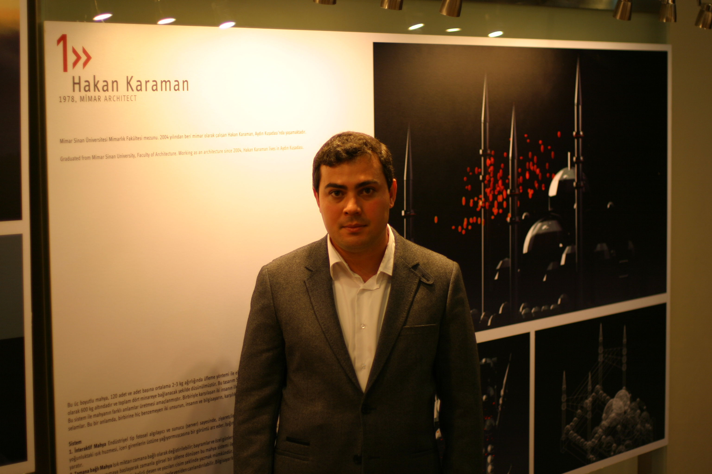
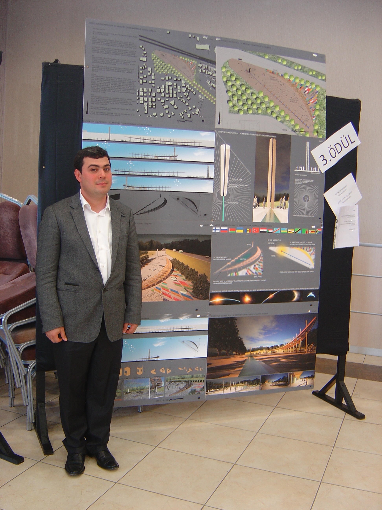
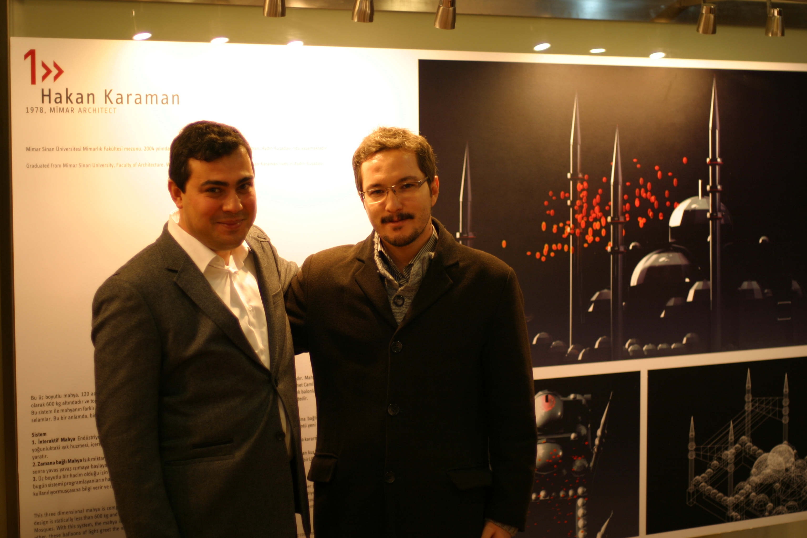

1978 doğumlu.\
1994-1996 Çukurova Üniversitesi’nde,\
1996-2004 Mimar Sinan Üniversitesi’nde
mimarlık eğitimi aldı.\
2002-2010 Tuncer Çakmaklı Mimarlık’ta
çalıştıktan sonra kendi ofisini açtı.\
Sürekli bir bilgi arayışı, yeni alanlar açma
ve mimariye katkı sağlama gayesindeki Hakan
Karaman tüm çalışmalarında fikir, işlev ve form
düzeni ile birlikteliğini esas alır.




