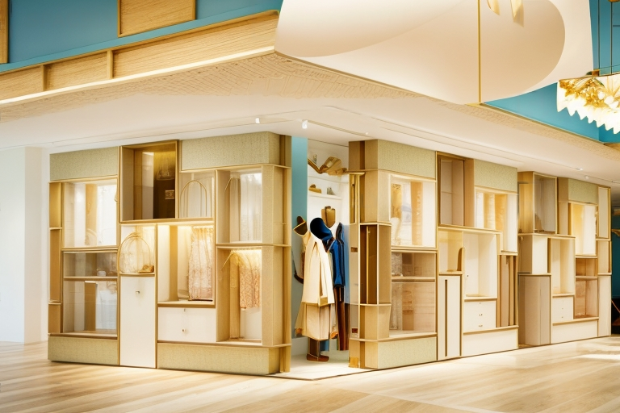
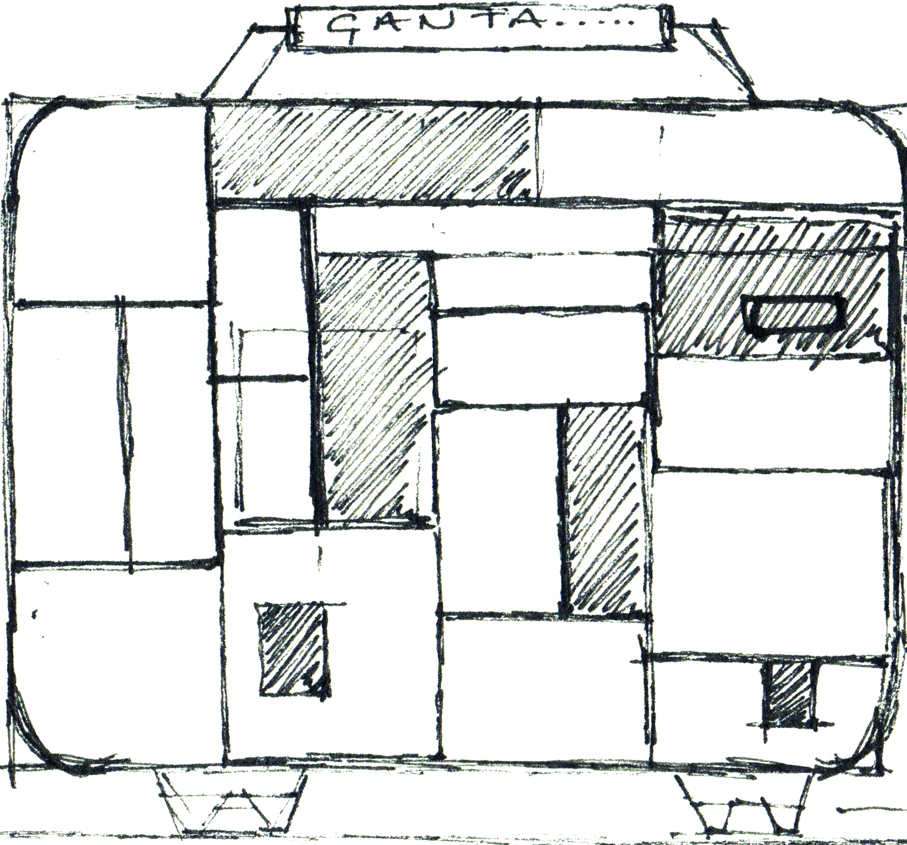
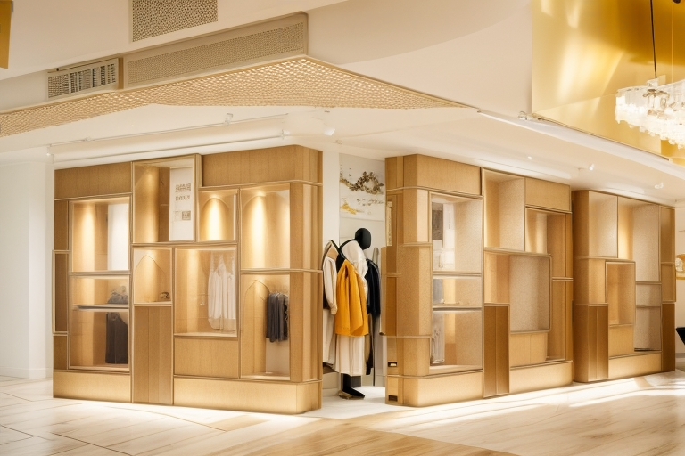

ДАТА: 2015  
МЕСТО: Кушадасы  

Этот проект разработан для магазина сумок, расположенного в туристическом районе. Витрина была спроектирована в форме сумки, чтобы быть легко различимой и привлекать внимание клиентов среди конкурирующих магазинов.




