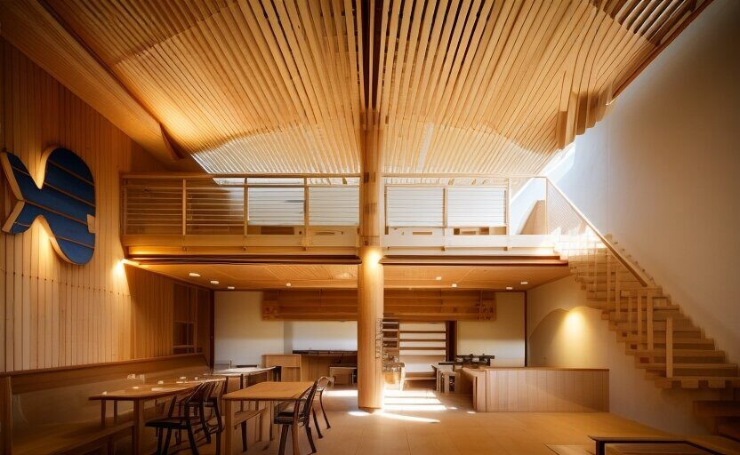
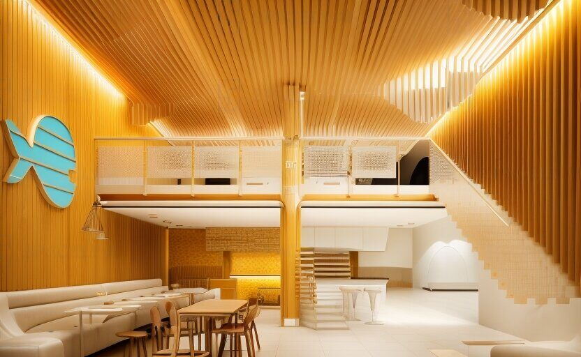
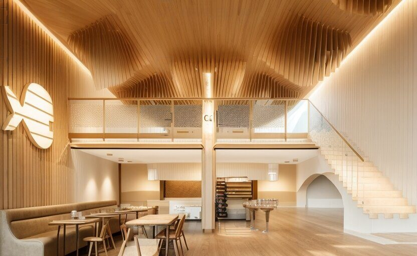
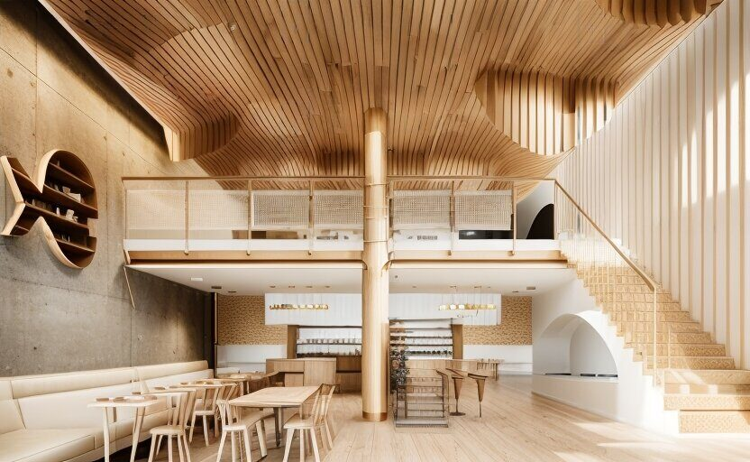

ДАТА: 2013  
МЕСТО: Кушадасы  

Инспирация для этого рыбного ресторана, расположенного у моря, приходит от волн. Эта форма заставляет нас чувствовать себя так, будто мы находимся внутри потопленного корабля.




