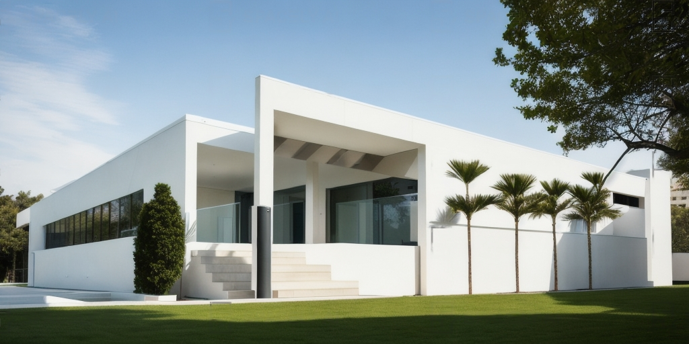
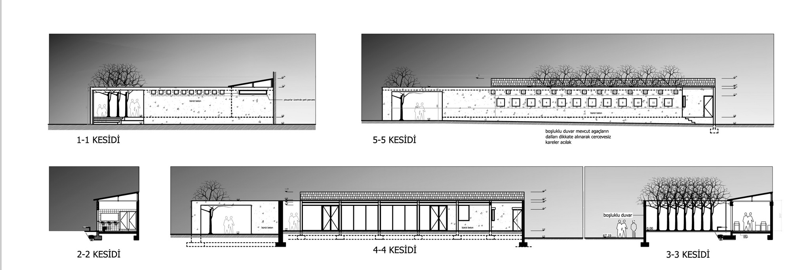
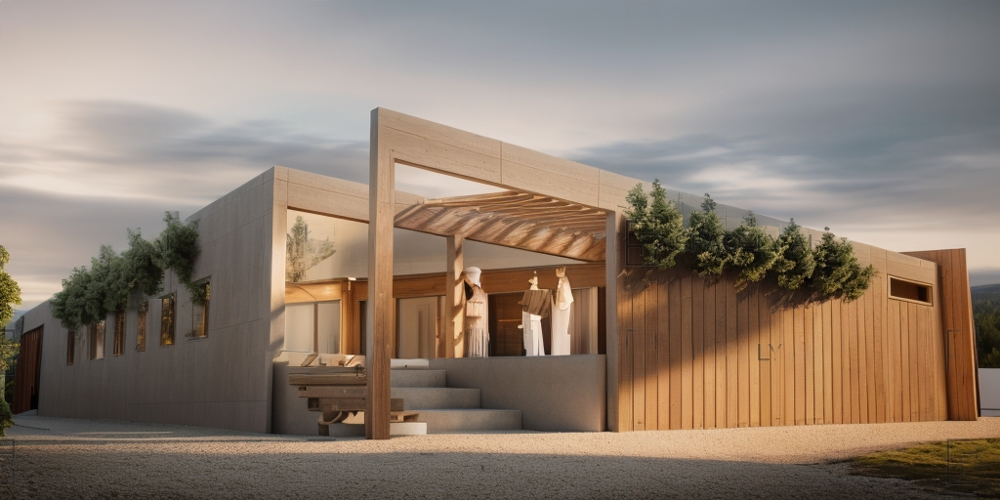
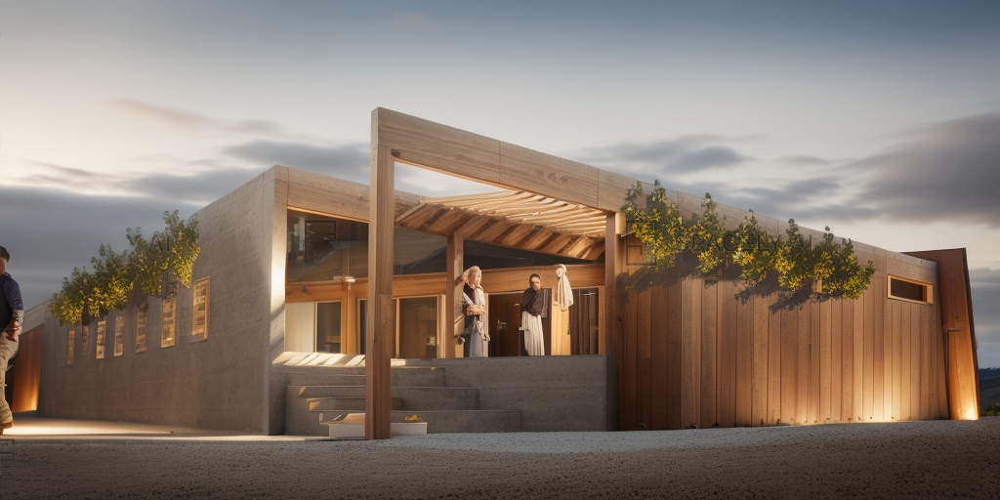
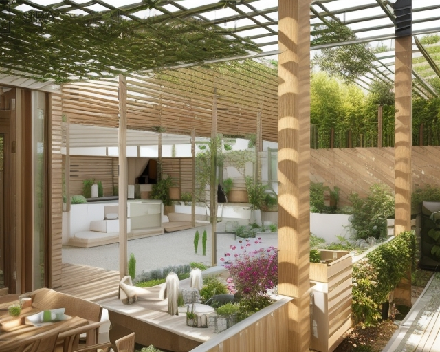
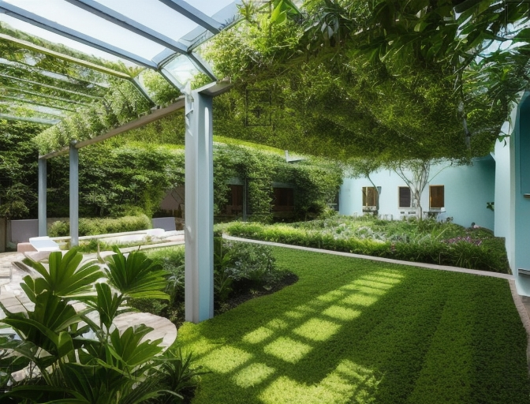
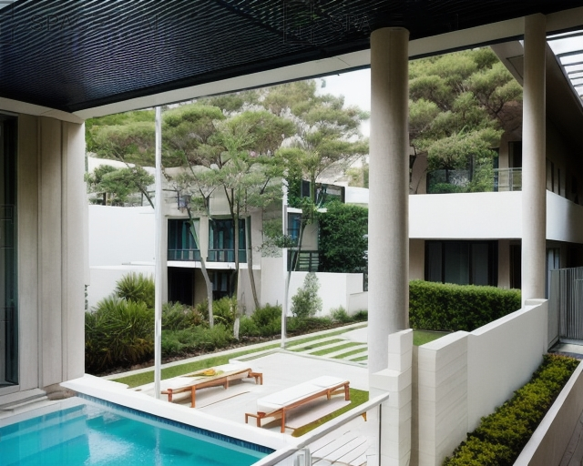
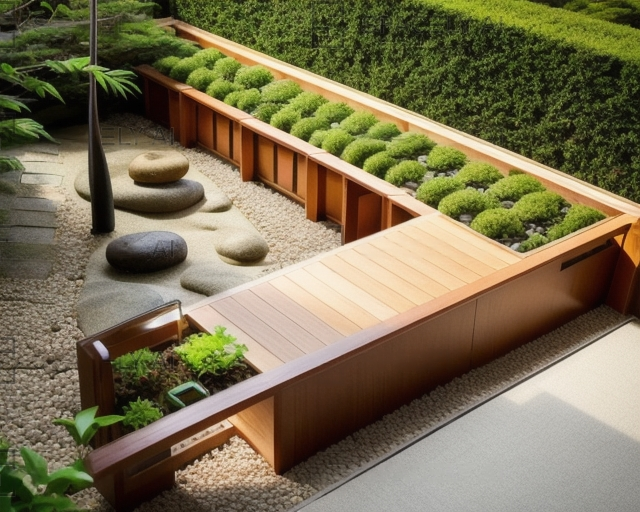

DATE: 2007  
LOCATION: Kuşadası

In response to the dirty and disorganized surroundings of an industrial site, this building is designed around an inward-facing courtyard, with additional spaces that complement it.




