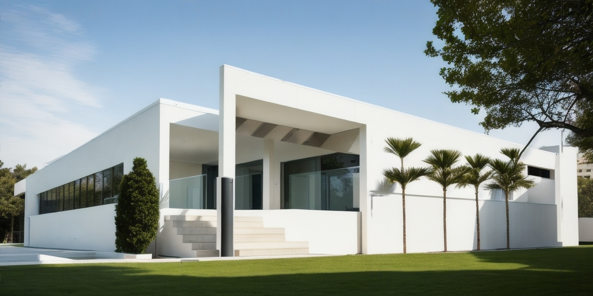
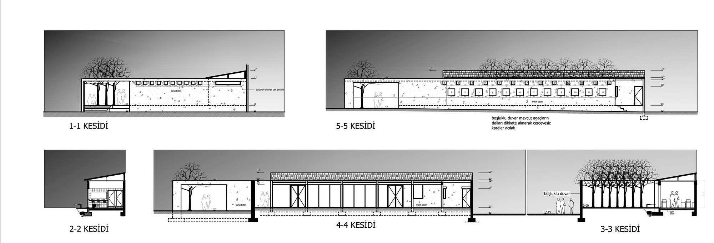
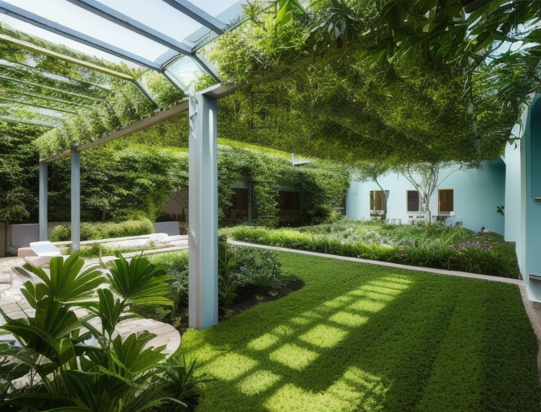

ДАТА: 2007  
МЕСТО: Кушадасы

В ответ на грязное и беспорядочное окружение промышленного района, этот здание построено вокруг внутреннего двора, который обращен внутрь, и включает в себя дополнительные помещения, дополняющие этот двор.




