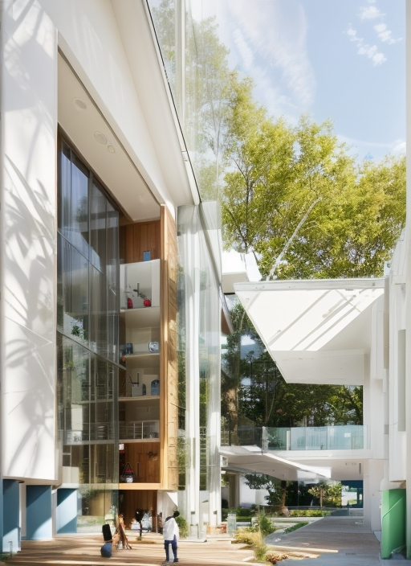

Этот проект представляет собой устойчивый и экологически чистый проект города, разработанный для конкурса Торговой Палаты Кайсери. Проект создан как важный шаг к более зеленой и устойчивой жизни в городах будущего.

Основные особенности:

1. Параболические Крышки: Проект покрыт крышками в форме параболической кривой, которые покрывают верхнюю часть помещения и крышу входа. Эти покрытия повышают энергетическую эффективность и обеспечивают эстетичный внешний вид.
2. Покрытие Зеленью: Проект использует зелень, чтобы внести природу в город. Эти зеленые покрытия предотвращают городское тепловое островное явление и увеличивают производство кислорода.
3. Устойчивость: Проект основан на принципах устойчивости. В нем используются возобновляемые источники энергии, системы уменьшения отходов и переработки для снижения окружающего воздействия.
4. Гибкое Планирование Объемов: Проект обеспечивает гибкость в объемном планировании, позволяя адаптироваться к меняющимся потребностям и будущему росту и развитию.
5. Удобство Использования: Проект ориентирован на обеспечение удобства для жителей и посетителей. Он облегчает городскую транспортировку, увеличивает зеленые зоны и способствует созданию социальных пространств.




