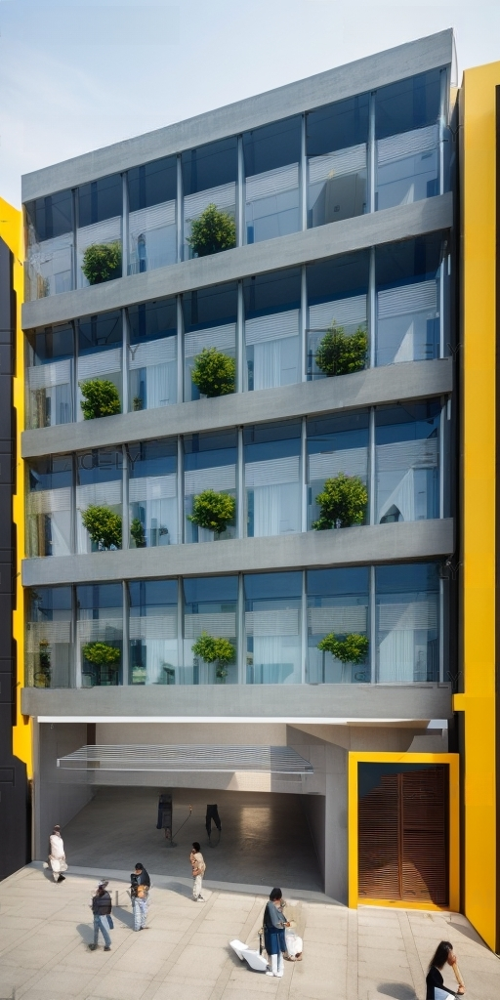
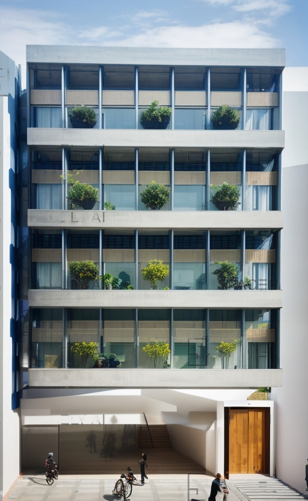

This five-story modern office building has been designed to perfectly align with the dynamics of urban life in the city center. The building's design combines contemporary architectural elements with a perfect balance of functionality and aesthetics.
Ground Floor: The ground floor features a large entrance lobby. This space warmly welcomes visitors, including a reception area, waiting zones, and a café. Additionally, there are stairs and elevators to facilitate movement between floors.
2nd Floor - 4th Floor: From the 2nd to the 4th floors, you'll find open-plan office spaces. These floors are designed to meet modern business requirements. Large windows allow natural sunlight to enter and create an inspiring work atmosphere. The flexible office layout can be adapted to accommodate different team sizes and needs.
5th Floor: The fifth floor includes meeting rooms, conference halls, and creative workspaces. It's the ideal place for business meetings, seminars, and creative projects. A large terrace offers employees and guests the opportunity to enjoy a city view.
Exterior Design: The exterior façade of the building is modern and blends with the city's surroundings. Glass and steel have been attractively used, with an emphasis on energy efficiency and environmental sustainability. The building is surrounded by environmentally friendly landscaping.
This five-story modern office building represents a functional and aesthetic design that perfectly matches the fast pace of business life and the dynamics of the urban environment.




