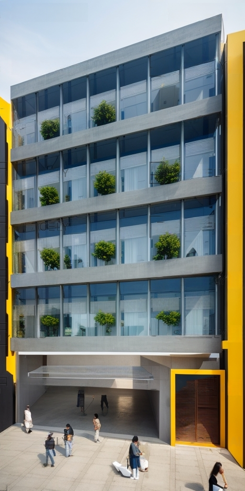

Это пятиэтажное современное офисное здание было разработано для идеального соответствия динамике городской жизни в центре города. Дизайн здания объединяет современные архитектурные элементы с идеальным балансом между функциональностью и эстетикой.
Первый этаж: На первом этаже находится большая вестибюльная зона. Это место тепло встречает посетителей, включая ресепшн, зоны ожидания и кафе. Кроме того, здесь есть лестницы и лифты для облегчения перемещения между этажами.
2-й этаж - 4-й этаж: Со 2-го по 4-й этажи отведены под открытые офисные помещения. Эти этажи разработаны с учетом современных требований бизнеса. Большие окна позволяют солнечному свету проникать внутрь и создают вдохновляющую рабочую атмосферу. Гибкая планировка офисов позволяет адаптировать пространство под разные размеры и потребности команды.
5-й этаж: Пятый этаж включает в себя переговорные комнаты, конференц-залы и творческие рабочие пространства. Это идеальное место для деловых встреч, семинаров и творческих проектов. Большая терраса предоставляет сотрудникам и гостям возможность насладиться видом на город.
Внешний дизайн: Внешний фасад здания современный и сочетается с окружающей средой города. Здесь привлекательно использовано стекло и сталь, уделяя внимание энергосбережению и экологической устойчивости. Здание окружено экологически чистым ландшафтным оформлением.
Это пятиэтажное современное офисное здание представляет собой функциональный и эстетичный дизайн, который идеально соответствует быстрому ритму деловой жизни и динамике городской среды.




