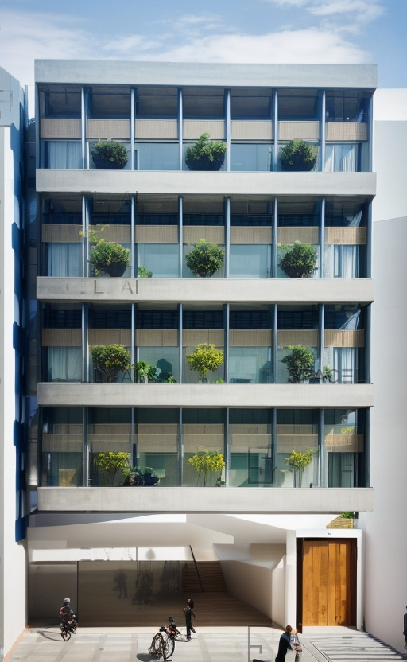

Bu beş katlı modern ofis binası, şehir merkezindeki dinamiklere mükemmel bir şekilde uyum sağlamak üzere tasarlanmıştır. Binanın tasarımı, çağdaş mimari unsurlarla birleştirilmiş, işlevsellik ve estetik açıdan mükemmel bir denge sağlar.
Zemin Kat: Zemin katta büyük bir giriş lobisi bulunur. Bu alan, ziyaretçileri sıcak bir karşılama sunarken, resepsiyon, bekleme alanları ve bir kafe gibi işlevsel alanlar içerir. Ayrıca, katlar arası iletişimi kolaylaştırmak için merdivenler ve asansörler bulunur.
2. Kat - 4. Kat: 2. kattan 4. kata kadar olan katlar, açık plan ofis alanlarına ayrılmıştır. Bu katlar, modern iş gereksinimlerine cevap vermek için tasarlanmıştır. Geniş pencereler, gün ışığının içeri girmesini sağlar ve çalışanlara ilham verici bir çalışma ortamı sunar. Esnek ofis düzenlemeleri, farklı ekip büyüklüklerine ve gereksinimlerine uyacak şekilde uyarlanabilir.
5. Kat: Beşinci kat, toplantı odaları, konferans salonları ve yaratıcı çalışma alanları gibi özel işlevsel alanlar içerir. Burası iş toplantıları, seminerler ve yaratıcı projeler için ideal bir mekandır. Büyük bir teras, çalışanlara ve ziyaretçilere şehir manzarasının tadını çıkarma fırsatı sunar.
Dış Tasarım: Binanın dış cephesi, modern ve şehre uyumlu bir şekilde tasarlanmıştır. Dikkat çekici bir şekilde cam ve çelik kullanılmış, enerji verimliliği ve çevresel sürdürülebilirlik göz önünde bulundurulmuştur. Bina, çevresel dostu peyzaj düzenlemeleriyle çevrilmiştir.
Bu 5 katlı modern ofis binası, iş dünyasının hızlı tempolarına ve şehir yaşamının dinamiklerine mükemmel bir şekilde cevap veren, işlevsel ve estetik açıdan düşünülmüş bir tasarım sunar.




