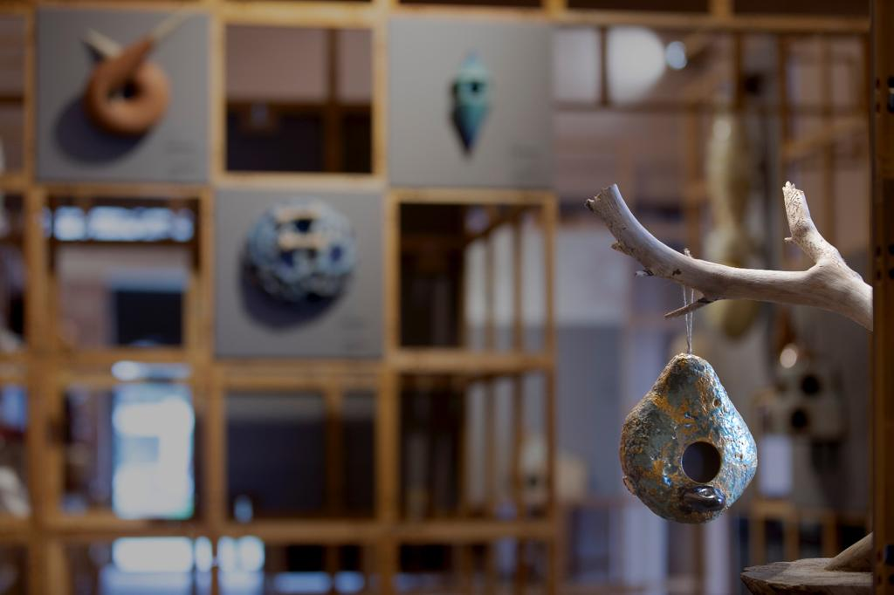
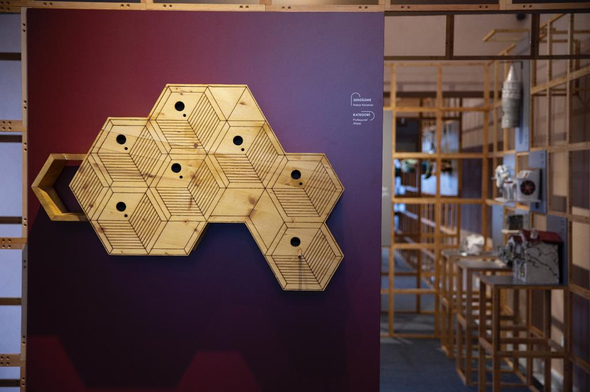
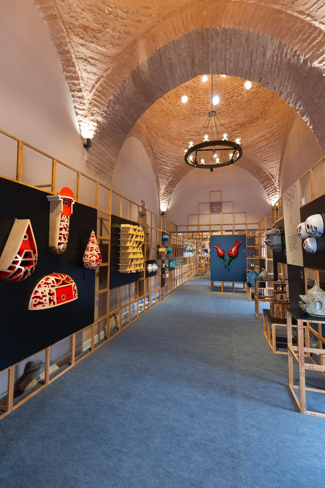

Этот дизайн был разработан для отелей, находящихся в богатых географических условиях с разнообразной растительностью, изобилием водных ресурсов и природными местообитаниями. В определенные периоды времени люди собирались на лугах и бухтах, чтобы слушать пение птиц, особенно соловьев, которые стали предметом множества литературных произведений, песен и народных песен. Кафе и парикмахерские наполнялись мелодиями канареек. "Эксперты", способные отличить птиц по их пению, цвету и размеру, всегда присутствовали в беседах. Были созданы больницы, такие как Gurabahane-i Laklakan, для ухода за перелетными птицами и аистами.
В глазах людей птицы имели особое значение. Птица за горой Каф была Фениксом, Хаджи Бекташ-и Вели преобразился в сокола, чтобы спасти Пророка Мухаммеда (да будет мир с ним) от преследователей, а голубь, который ежегодно посещал мечети и облетал Каабу, считался "главой птиц".
Таким образом, любовь к птицам, укорененная в богатой символике птиц в турецкой культуре, была влияна как доисламскими, так и послеисламскими традициями.
Когда все эти элементы сочетаются, проявляется один из уникальных аспектов нашей цивилизации: птичьи домики.
Птичьи домики, встроенные в такие сооружения, как особняки, дворцы, мечети, молельные комнаты, гробницы, караван-сараи и общественные фонтаны, являются результатом такой глубокой и искренней любви, исторического накопления, сострадания и милосердия. Они являются архитектурным проявлением этого изысканного вкуса, мировоззрения и этикета.
Анализируя традиции, мы видим, что птичьи домики были повлияны архитектурным восприятием эпохи. В период, когда простота классической эпохи уступила место принятию барокко в архитектуре, птичьи домики приобрели более динамичный стиль. Это является одним из основных моментов нашего дизайна: необходимостью пересматривать птичьи домики с учетом архитектурного понимания периода и, при этом, учитывая ссылки из прошлого. При этом мы также планируем рассматривать вклад птичьих домиков в экосистему, помимо их эстетического влечения.




