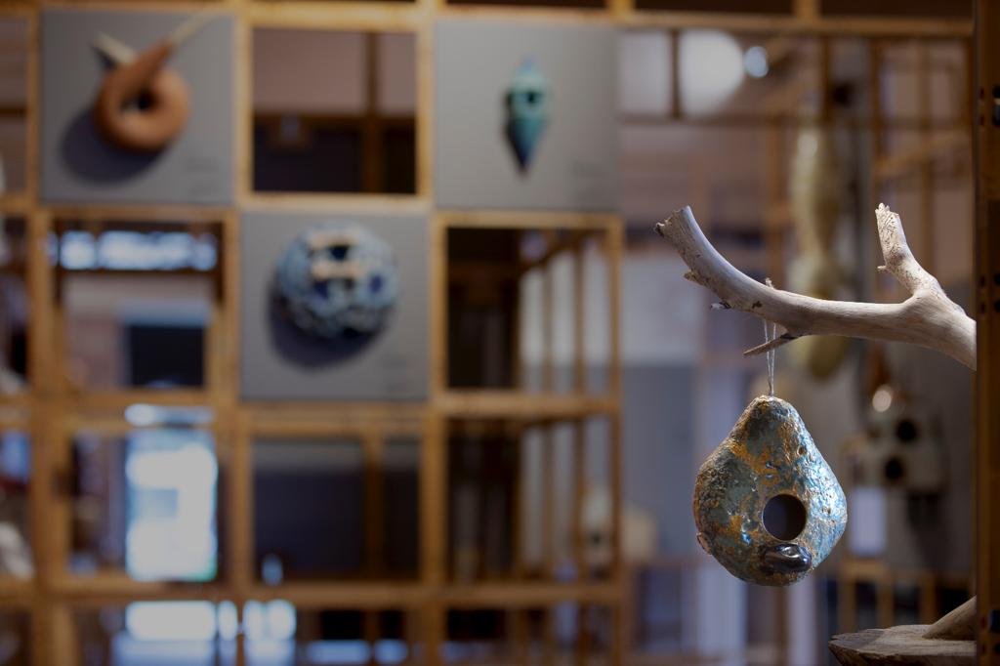
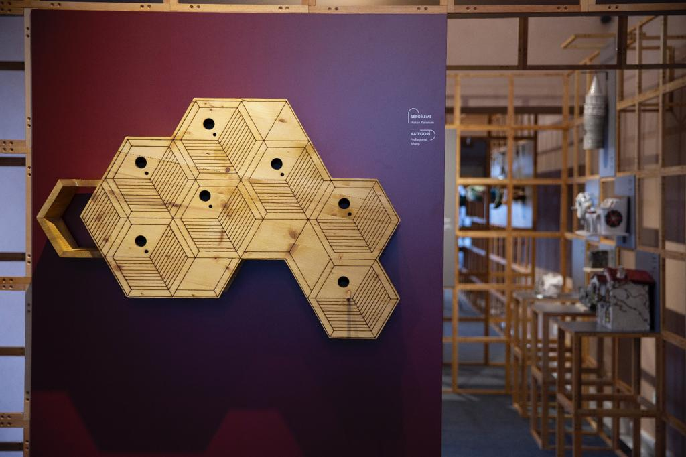
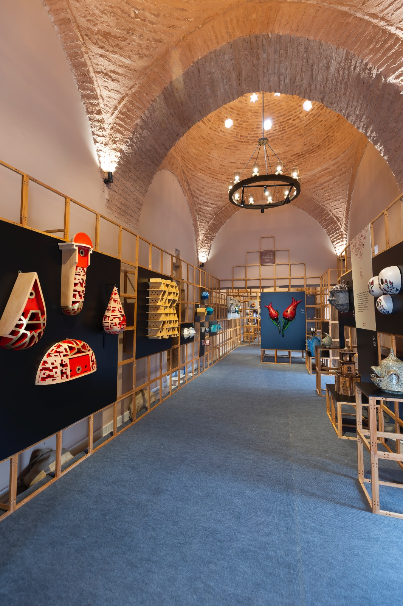
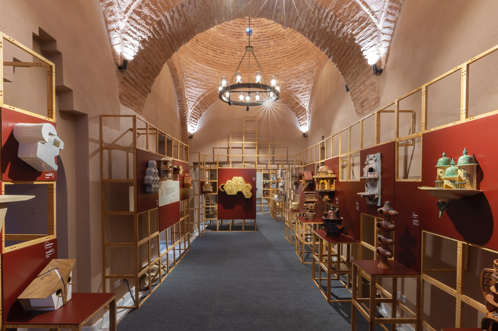
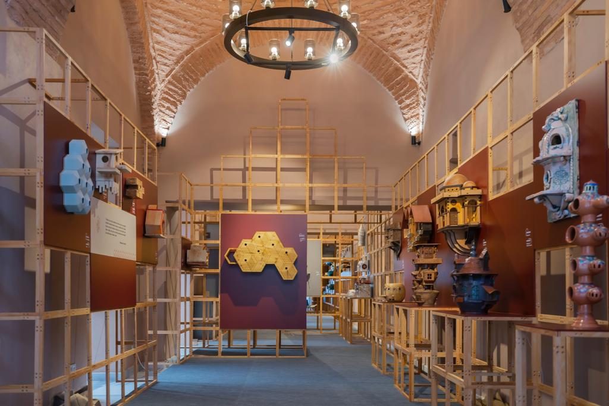
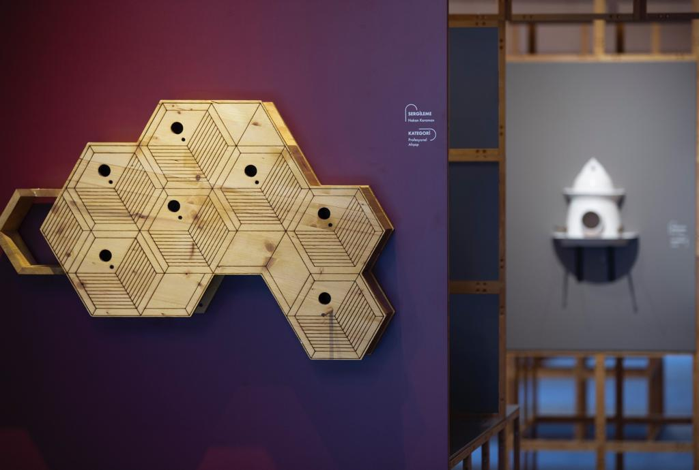

In Ottoman cities blessed with a rich geography, encompassing diverse flora, abundant water resources, and natural habitats, a rich culture of birds also thrived. During certain periods, people would flock to meadows and coves to listen to the songs of birds, especially the nightingales, which have been the subject of numerous literary works, songs, and folk songs. Coffeehouses and barber shops resounded with the melodies of canaries. "Experts" who could distinguish birds by their songs, colors, and sizes were always part of the conversations. Hospitals like Gurabahane-i Laklakan were established to care for migrating birds and storks.
In the eyes of the people, birds held special significance. The bird beyond Mount Kaf was the Phoenix, Hacı Bektaş-ı Veli transformed into a falcon to rescue Prophet Muhammad (peace be upon him) from pursuers, and the dove that annually visited mosques and circled the Kaaba was believed to be the "leader of birds."
Hence, the love for birds, rooted in the rich bird symbolism in Turkish culture, was influenced by both pre-Islamic and post-Islamic traditions.
When all these pieces come together, one of the unique aspects of our civilization emerges: Birdhouses.
Birdhouses integrated into structures such as mansions, palaces, mosques, prayer rooms, tombs, caravanserais, and public fountains are the result of such great and profound love, historical accumulation, compassion, and mercy. They are the architectural manifestation of this refined taste, worldview, and etiquette.
Looking at the tradition, we can see that birdhouses were influenced by the architectural understanding of the era. During the period when the simplicity of the classical era gave way to the adoption of baroque architecture, birdhouses embraced a more dynamic style. This forms one of the fundamental points of our design: the need to redesign birdhouses in accordance with the architectural understanding of the period while considering the references from the past. In doing so, we also plan to consider the contributions of birdhouses to the ecosystem, beyond their aesthetic appeal."

Zengin bir coğrafyaya; bitki örtüsüne, su kaynaklarına, doğal yaşam alanlarına sahip Osmanlı kentlerinde bir o kadar zengin bir kuş kültürü mevcuttu. Belirli dönemlerde insanlar kuşların ötüşlerini –özellikle pek çok edebiyat eserine, şarkıya türküye konu olmuş bülbülleri– dinlemek için çayırları, koyları doldururdu. Kahvehaneler, berber dükkânları kanarya sesiyle çınlardı. Kuşları ötüşlerinden, renklerinden, boylarından ayırt edebilen “uzmanlar” sohbetlerden eksik olmazdı. Kuşların tedavisi için Gurabahane-i Laklakan gibi göçmen kuşların ve leyleklerin tedavisiyle ilgilenen hastaneler kurulmuştu. Kuş; Kaf Dağı’nın ardındaki Zümrüd-ü Anka idi, şahin kılığına giren Hacı Bektaş-ı Veli, yaptığı yuvayla Hz. Muhammed’i (s.a.v.) peşine düşenlerin elinden kurtaran güvercin, her yıl yaptığı yolculukla camileri ziyaret edip Kabe’yi tavaf ettiğine inanılan “kuşların şeyhi” leylekti. Bu nedenle kuşlara yönelik bu sevginin temelinde İslamiyet’in kabulü öncesinde gerekse de sonrasında Türk kültüründeki güçlü kuş imgeleminin de payı büyüktü. Tüm bu parçalar bir araya geldiğinde ortaya medeniyetimizin hususi taraflarından biri ortaya çıkmış oldu: Kuş evleri. Köşk, saray, cami, mescid, türbe, han, sıbyan mektebi, çeşme gibi yapılara dahil edilen kuş evleri işte böylesine büyük ve yoğun bir sevginin, tarihsel birikimin, şefkatin, merhametin ürünüdür. Bunun mimarideki karşılığıdır, bu ince zevkin, hayat anlayışı ve görgüsünün yansımasıdır. Geleneğe baktığımızda kuş evlerinin dönemin mimari anlayışından etkilendiğini görürüz, klasik dönemdeki sadelik barok mimarinin benimsendiği dönemde yerini hareketli bir tarza bırakmıştır. Bu da tasarımımızın temel noktalarından birini oluşturmaktadır, yani geçmişten gelen referansların göz önünde bulundurarak kuş evlerinin dönemin mimari anlayışına uygun bir şekilde yeniden tasarlanması ihtiyacı. Bunu yaparken de kuş evlerinin estetik olarak sundukları zevkin yanında ve ötesinde eko sisteme katkılarının ne olabileceğinin planlanması. 




