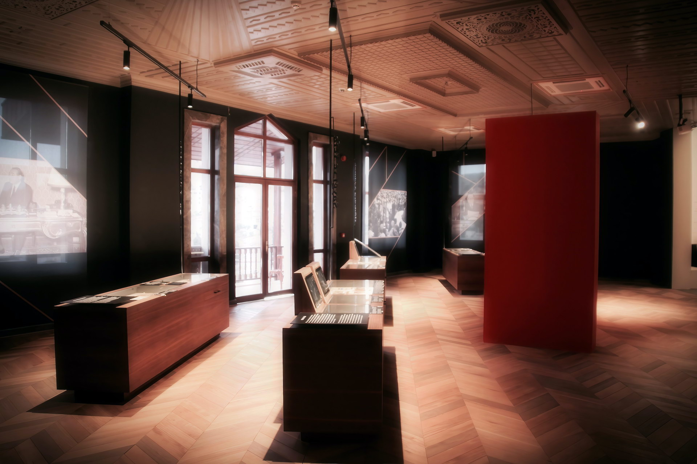
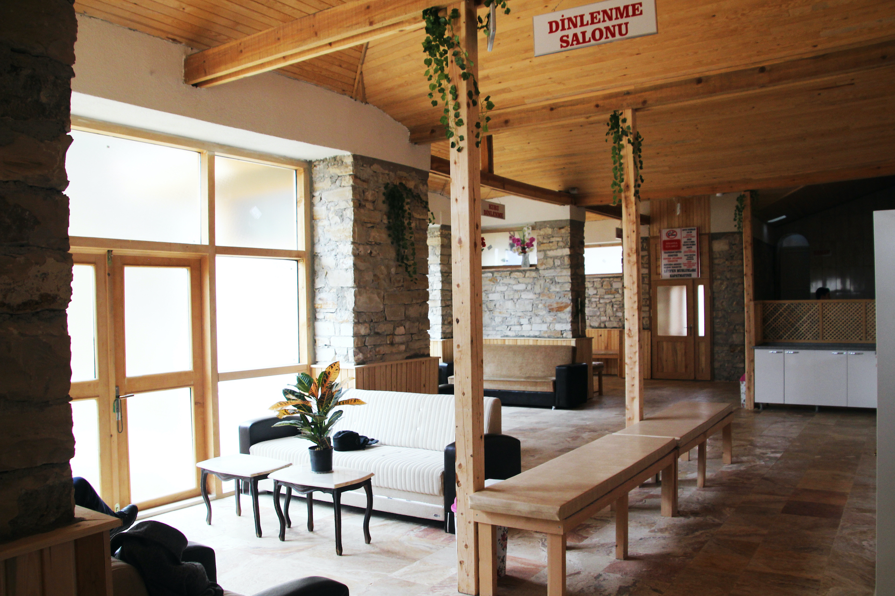
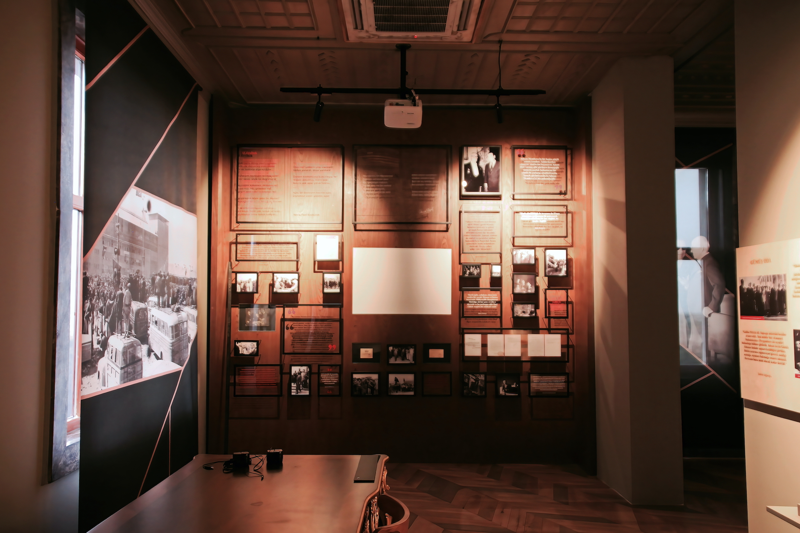
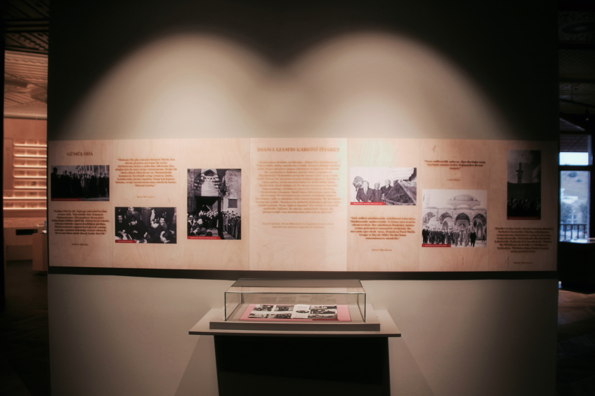
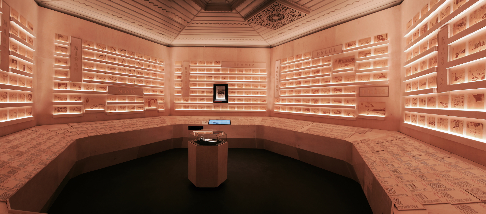

Adnan Menderes, who came to power in the first democratic election in Turkey and served as Prime Minister between 1950 and 1960, was born in Aydın. The Menderes era is considered an important period in Turkey's democratic history, but in the end it remained a sad memory.

Details about Menderes' life are important to understand his personality and struggle. The farmhouse in Koçarlı, where Menderes spent his childhood, was turned into a museum as a result of the efforts of the Aydın governorship. This museum can be visited to understand Menderes' life and services.




