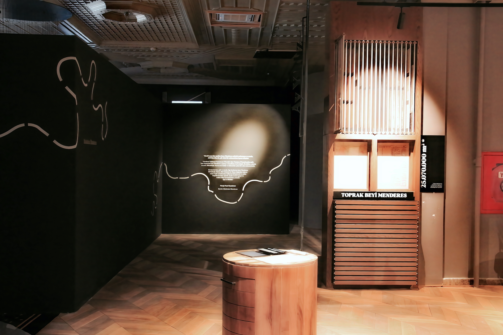
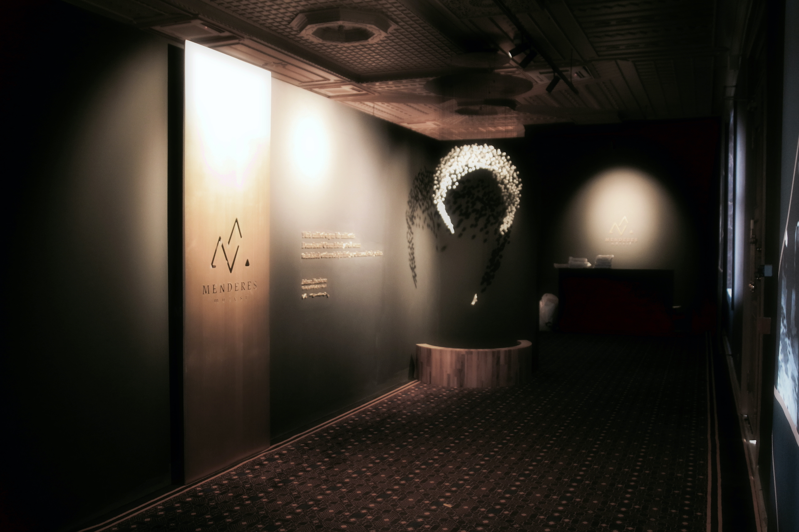

Аднан Мендерес, пришедший к власти на первых демократических выборах в Турции и занимавший пост премьер-министра с 1950 по 1960 год, родился в Айдыне. Эпоха Мендереса считается важным периодом в демократической истории Турции, но в конечном итоге она осталась печальным воспоминанием.

Подробности о жизни Мендереса важны для понимания его личности и борьбы. Фермерский дом в Кочарлы, где Мендерес провел свое детство, усилиями губернатора Айдына был превращен в музей. Этот музей можно посетить, чтобы понять жизнь и услуги Мендереса.




