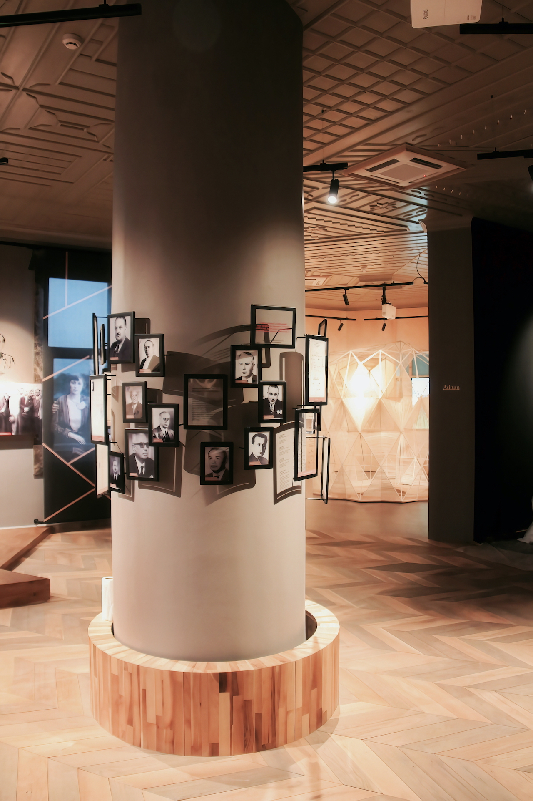

Türkiye'de ilk demokratik seçimle iktidara gelen ve 1950 ila 1960 yılları arasında Başbakanlık yapmış olan Adnan Menderes, Aydın doğumludur. Menderes dönemi, Türkiye'nin demokrasi tarihinde önemli bir dönem olarak kabul edilir, ancak sonunda hüzünlü bir hatıra olarak kalmıştır.

Menderes'in yaşamına dair detaylar, onun kişiliğini ve mücadelesini anlamak için önemlidir. Menderes'in çocukluk yıllarını geçirdiği Koçarlı'daki çiftlik evi, Aydın valiliğinin çabaları sonucunda müzeye dönüştürülmüştür. Bu müze, Menderes'in hayatını ve hizmetlerini anlamak için ziyaret edilebilir.




