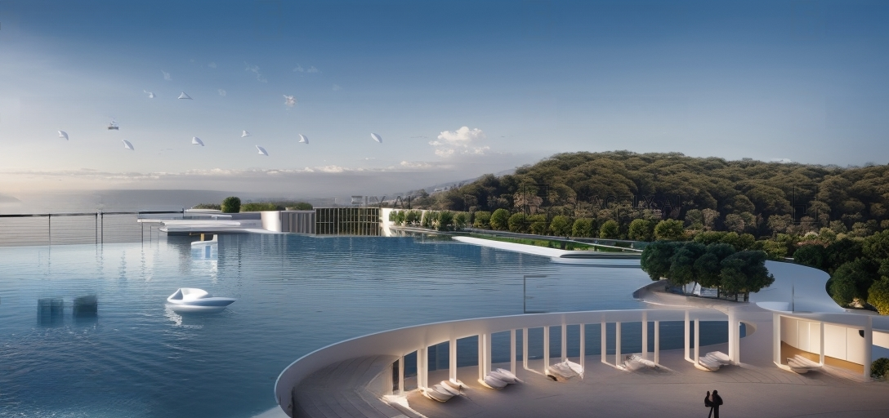
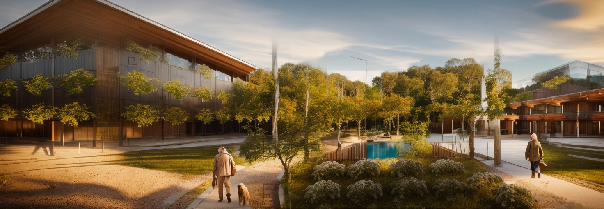
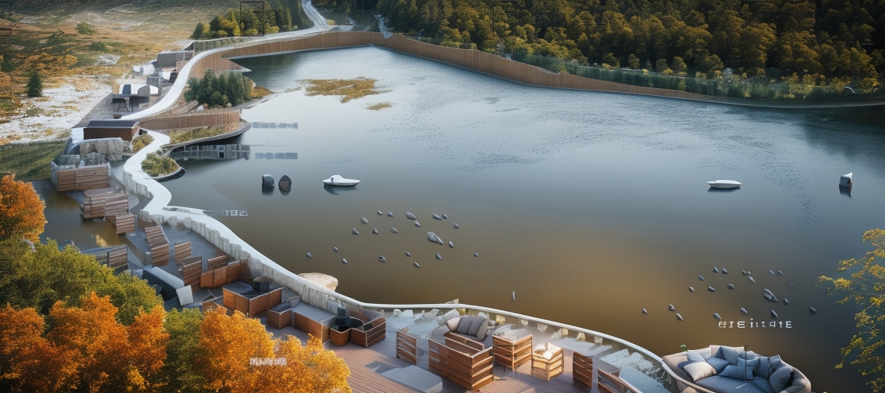

DATE: 2012
LOCATION: İzmir - Çeşme

This project, conducted for the Municipality of Çeşme, consists of canopies, squares, and a plant system. The canopies, with their dynamic form that expands and contracts in different areas, serve as protection against climatic effects. They also incorporate three observation terraces, one large square, and a dedicated event area. The section from the bus terminal to the beach, as well as the entire coastline, is covered by a 1296-meter-long canopy, which is highlighted at night by lighting along its length.

The main concept of this project is the addition of a "shell" to the building.
This shell, composed of steel structures, wooden planters, and a solar energy
and irrigation system, aims to provide both climatic protection for the
buildings and an extension of their lifespan. It also aims to enhance the
structural resilience during earthquakes.




