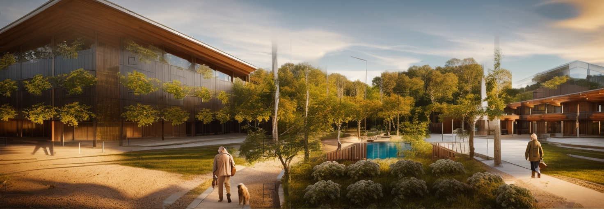

ДАТА: 2012 год  
МЕСТО: Измир - Чешме

Этот проект, выполненный для муниципалитета Чешме, состоит из навесов, площадей и системы растительности. Навесы с их динамичной формой, которая расширяется и сжимается в разных зонах, служат защитой от климатических воздействий. Они также включают три смотровых террасы, одну большую площадь и отдельную зону для мероприятий. Секция от автобусного терминала до пляжа, а также вся побережье покрыты 1296-метровым навесом, который подчеркивается ночью освещением вдоль его длины.

Основная идея этого проекта - добавление "оболочки" к зданию. Эта оболочка, состоящая из стальных конструкций, деревянных цветочных горшков и системы солнечной энергии и орошения, стремится обеспечить как климатическую защиту для зданий, так и продление их срока службы. Она также направлена на повышение структурной устойчивости в случае землетрясений.




