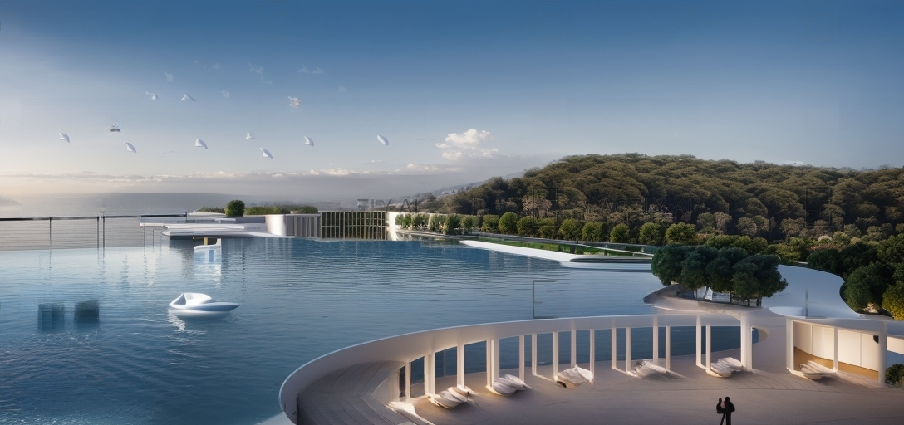

TARİH: 2012  
YER: İzmir - Çeşme

Çeşme Belediyesi için yapılan bu proje saçaklar, meydanlar
ve bitki sisteminden meydana gelmektedir. Yer yer genişleyip
daralan bu dinamik biçimi ile saçaklar iklimsel etkilere karşı
korurken, aynı zamanda 3 seyir terası, 1 büyük meydan bir de
özel etkinlik alanını bir arada tutmaktadır. Otogardan sahile
kadar olan kısım ile sahilin tamamını kapsayan 1296 metre
uzunluğundaki diğer parçası saçak boyunca uzanan ışıklandırma
ile geceleri kendini belli etmektedir.
Bu projedeki ana fikir binaya eklenen kabuktur.
Bu kabuk çelikten taşıyıcı, ahşaptan saksı ve güneş enerjisi ve
sulama sistemi ile birlikte binaların hem iklimsel korunması
hem binanın yapı ömrünü uzatıp deprem esnasında dayanımını
arttırması amaçlanmıştır.




