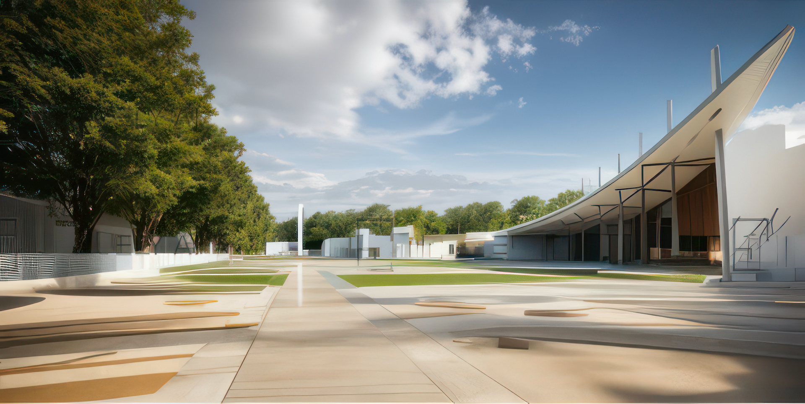
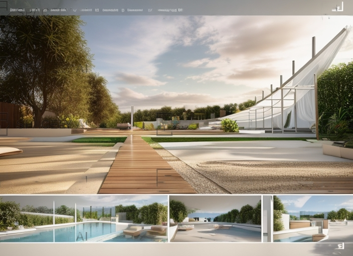

Date: 2012  
Location: Kocaeli/Kartepe

This project was developed for Kocaeli/Kartepe Municipality. The design is a walking path that encompasses the entire parcel, carrying flexible units under a giant sundial and a large canopy, thanks to occasional voids on the main rib symbolizing the features of the meridian.
The main rib opens up to a flower garden composed of flags from 15 countries symbolizing the 30th meridian, which surrounds the walking path. This area can be used for purposes such as weddings, meetings, concerts, cafes, and exhibitions. All these elements are interconnected.
The sun symbol in the square represents the rays that illuminate the gardens, and the parcelation is formed accordingly. A water element accompanies the walking path, and the transitional areas between the countries on top of it are connected by bridges.




