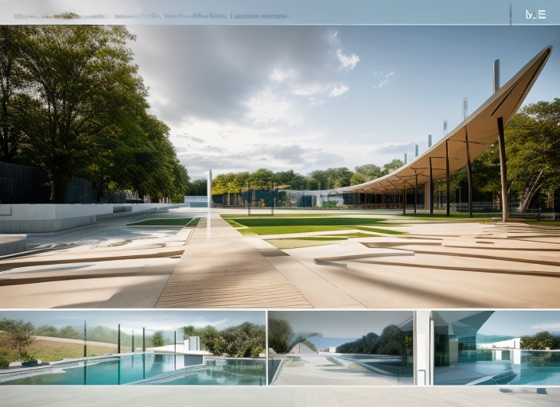
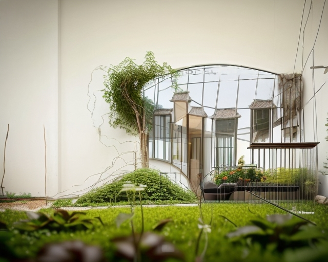

Дата: 2012 год  
Место: Коджаэли/Картепе  

Этот проект был разработан для муниципалитета Коджаэли/Картепе. Дизайн представляет собой пешеходную дорожку, охватывающую всю территорию, несущую гибкие блоки под гигантским солнечным циферблатом и большим навесом, благодаря промежуточным пустотам на основной ребре, символизирующим особенности меридиана.
Основное ребро открывается к цветнику, состоящему из флагов 15 стран, символизирующих 30-й меридиан, который окружает пешеходную дорожку. Это место может использоваться для свадеб, встреч, концертов, кафе и выставок. Все эти элементы взаимосвязаны.
Солнечный символ на площади представляет лучи, которые освещают сады, и согласно этому формируется планировка участка. Водный элемент сопровождает пешеходную дорожку, а переходные зоны между странами находятся над ними и связаны мостами.




