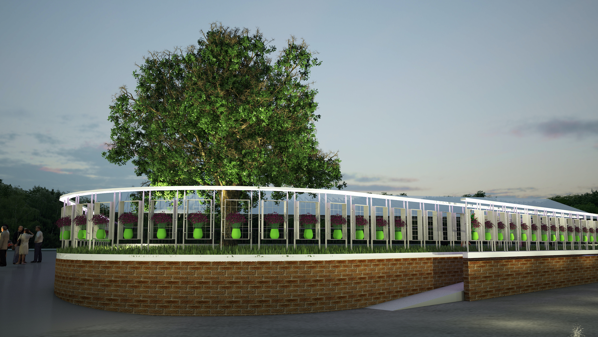
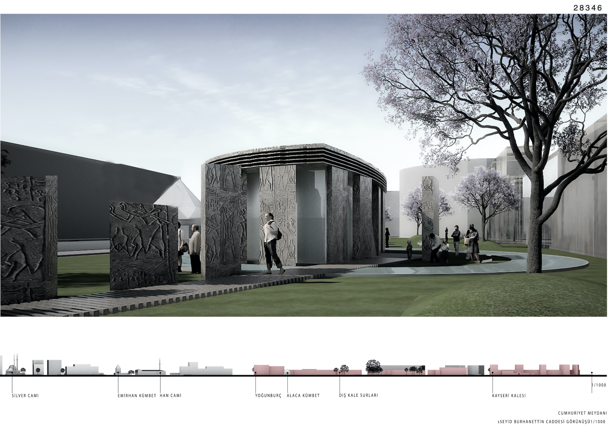
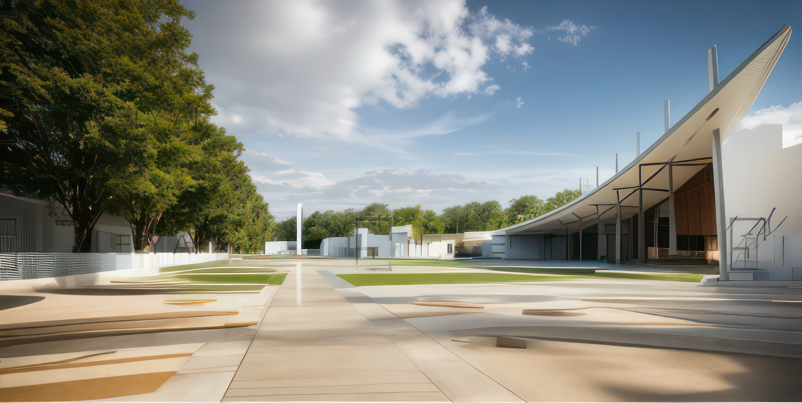
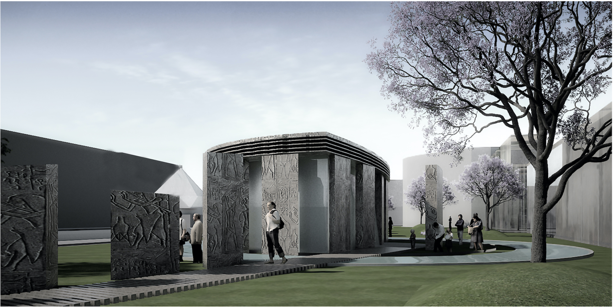
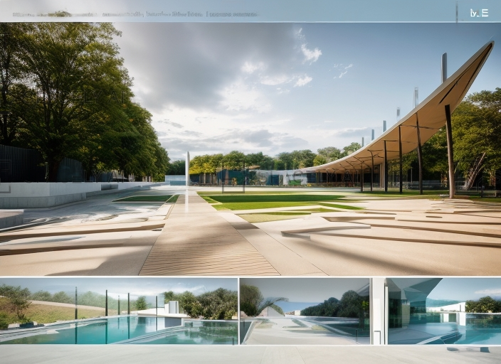
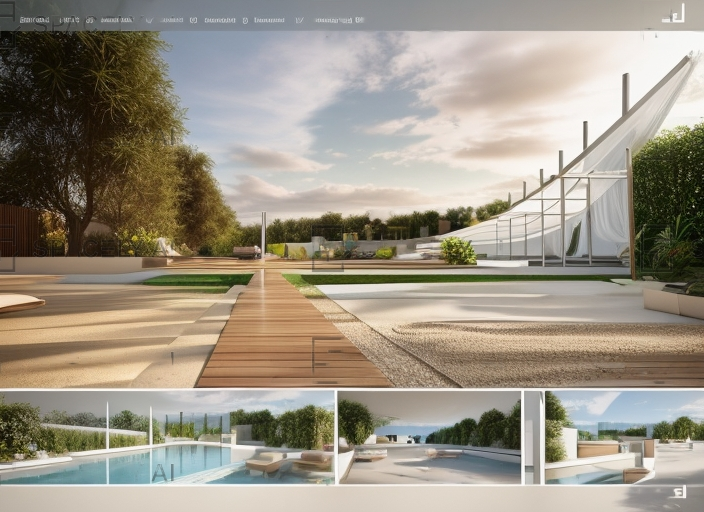
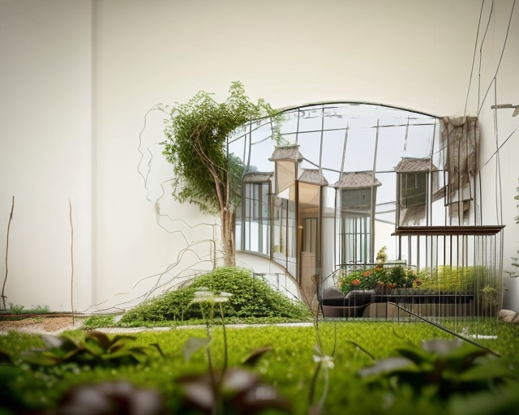

Tarih: 2012  
Yer: Kocaeli/Kartepe

Bu proje Kocaeli/Kartepe Belediyesi için geliştirildi. Tasarım, meridyenin özelliklerini simgeleyen ana kaburga üzerindeki yer yer boşluklar sayesinde dev bir güneş saati ve geniş bir gölgelik altında esnek birimleri taşıyan, parselin tamamını kapsayan bir yürüyüş yolu.
Ana kaburga, yürüyüş yolunu çevreleyen 30. meridyeni simgeleyen 15 ülkenin bayraklarından oluşan bir çiçek bahçesine açılıyor. Bu alan düğün, toplantı, konser, kafe, sergi gibi amaçlarla kullanılabilir. Bütün bu unsurlar birbiriyle bağlantılıdır.
Meydandaki güneş sembolü bahçeleri aydınlatan ışınları temsil etmekte olup parselasyon buna göre oluşturulmuştur. Yürüyüş yoluna bir su unsuru eşlik ediyor ve onun üzerindeki ülkeler arasındaki geçiş alanları köprülerle birbirine bağlanıyor.




