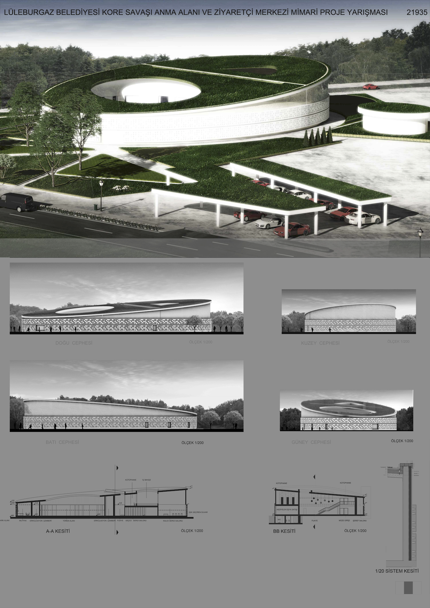
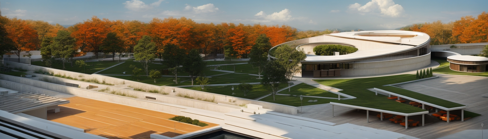
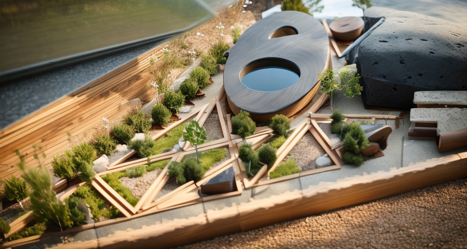
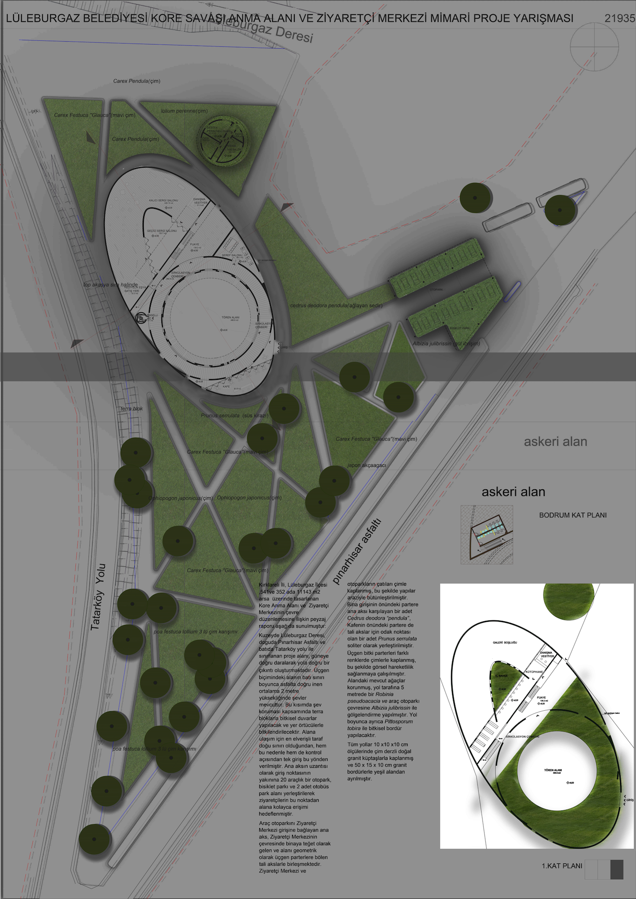

Project design concept of the korean war commemoration area and visitor center emphasizes the solidarity of the turkish army, which reached out to korean soils not only on the battlefield but also behind the lines.
memorial area and visitor center.
Except for the administration building, all units (temporary exhibition hall, permanent exhibition hall, honor hall, ceremony area, cafeteria, foyer area, library, toilets) are gathered here. a circulation circle has been conceived for the design of this section. this circle will be a preparatory and effective guidance element in transitions to the area and access to the ceremony area.
roads one of the key elements of this idea is the roads leading to the memorial area and visitor center (main space). these roads, which intersect, converge, and meet with each other, define the main space. they carry elements such as peace, brotherhood, diversity, and multiculturalism on their way to it, and these intersections create a large garden. the segments of the garden that arise from these intersections can be used to represent the participating countries in the war.
courtyard it is circular in shape. this form was considered to ensure equality for everyone and to bring everyone together equally.
this design, i.e., bringing all units under a single narrative; from the perspective of cost, public space left behind, preservation of existing trees, and the use of the space as a part of nature, offers an economic, public-friendly, and environmentally friendly solution.




