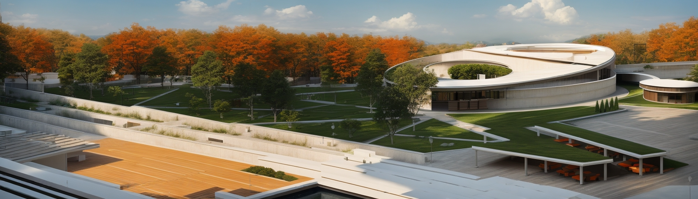
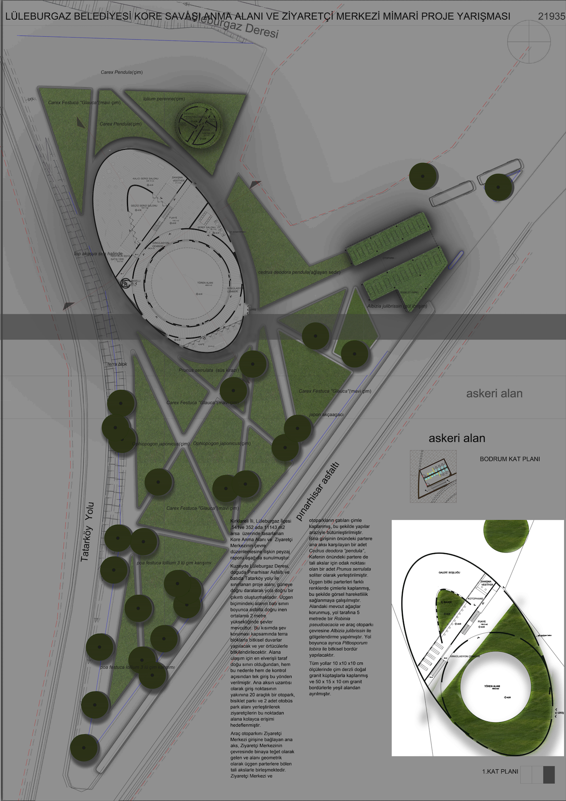

Люлебургазская городская администрация. конкурс проектов памятника и центра посетителей, посвященного корейской войне.
Концепция дизайна проекта области памяти корейской войны и центра посетителей уделяет основное внимание солидарности турецкой армии, которая протянула руку помощи корейской земле не только на поле боя, но и позади линий.
Площадка памяти и центр посетителей (основное пространство), за исключением административного здания, здесь собраны все единицы (временная выставочная зала, постоянная выставочная зала, зал почета, место для церемоний, кафе, фойе, библиотека, туалеты). для дизайна этой части было предусмотрено кольцо циркуляции. это кольцо будет служить подготовительным и эффективным элементом на пути к площади и доступу к месту церемонии.
Дороги одно из главных элементов этой идеи - это дороги, ведущие к площадке памяти и центру посетителей (основному пространству). эти дороги, которые пересекаются, сходятся и встречаются друг с другом, определяют основное пространство. они несут элементы, такие как мир, братство, разнообразие и многонациональность, и эти пересечения создают большой сад. сегменты сада, возникшие из этих пересечений, могут быть использованы для представления участвующих стран в войне.
Двор он круглый по форме. эта форма была выбрана для обеспечения равноправия для всех и собрания всех в равном объединении.
Этот дизайн, то есть сбор всех единиц под одним общим сюжетом; с точки зрения затрат, освобожденной общественной площади, сохранения существующих деревьев и использования пространства как части природы, предлагает экономичное, общественно-дружелюбное и экологически дружественное.




