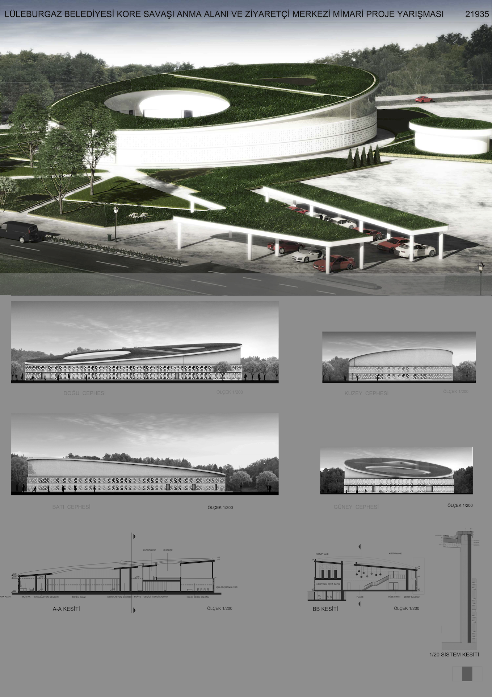
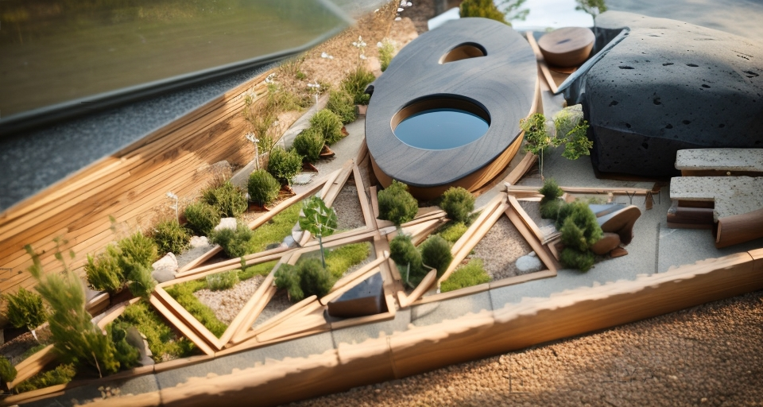

LÜLEBURGAZ BELEDİYESİ KORE SAVAŞI ANMA ALANI VE ZİYARETÇİ MERKEZİ
PROJE YARIŞMASI

PROJENİN TASARIM KONSEPTİ KORE TOPRAKLARINA YARDIM ELİNİ UZATAN TÜRK ORDUSUNUN
SADECE CEPHEDE DEĞİL CEPHE GERİSİNDE DE GERÇEKLEŞTİRDİĞİ DAYANIŞMAYI ESAS ALIR.

ANMA ALANI VE ZİYARETÇİ MERKEZİ
(ANA MEKÂN)

İDARE BİNASI HARİCİNDE BÜTÜN BİRİMLER (GEÇİCİ SERGİ SALONU, KALICI SERGİ SALONU, ŞEREF
SALONU, TÖREN ALANI, KAFE, FUAYE ALANI, KÜTÜPHANE, TUVALETLER) BURADA TOPLANMIŞTIR.
BU BÖLÜMÜN TASARIMI İÇİN BİR SİRKÜLASYON ÇEMBERİ DÜŞÜNÜLMÜŞTÜR. BU ÇEMBER ALANA
GEÇİŞLERDE VE TÖREN ALANINA ULAŞMADA HAZIRLIK VE ETKİN BİR YÖNLENDİRME UNSURU
OLACAKTIR.

YOLLAR
BU FİKRİN SAÇ AYAKLARINDAN BİRİ ANMA ALANI VE ZİYARETÇİ MERKEZİNE (ANA MEKÂN) GİDEN
YOLLARDIR. BİRBİRİYLE KEŞİŞEN, KARŞILAŞAN, BULUŞAN BU YOLLAR ANA MEKÂNI DA TANIMLAR.
ONA GİDEN BARIŞ, KARDEŞLİK, ÇEŞİTLİLİK, ÇOK RENKLİLİK GİBİ UNSURLARI ÜZERİNDE TAŞIR VE BU
KEŞİŞMELER BÜYÜK BİR BAHÇEYİ MEYDANA GETİRİR. KESİŞMELERDEN DOĞAN BAHÇENİN
BÖLÜMLEMELERİ SAVAŞA KATILAN ÜLKELERİN TEMSİLİYETLERİ İÇİN KULLANILABİLİR.

AVLU
DAİRE BİÇİMDEDİR. HERKESE EŞİT OLMASI, HERKESİ EŞİT ŞEKİLDE BİR ARAYA GETİRMESİ
MAKSADIYLA BU FORM DÜŞÜNÜLMÜŞTÜR.

BU TASARIM, YANİ TÜM BİRİMLERİN TEK BİR HİKÂYE ALTINDA TOPLANMASI; MALİYET, KAMUYA
BIRAKILAN ALAN, MEVCUT AĞAÇLARIN KORUNMASI VE MEKÂNIN DOĞANIN BİR PARÇASI OLARAK
KULLANILMASI GİBİ AÇILARDAN BAKILDIĞINDA EKONOMİK, KAMUSAL YARARI GÖZETEN VE DOĞA
DOSTU BİR ÇÖZÜM SUNMAKTADIR.




