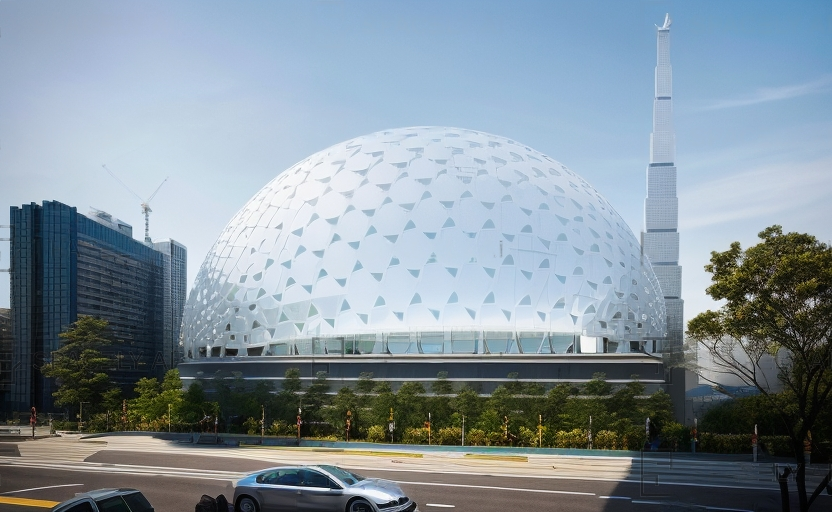
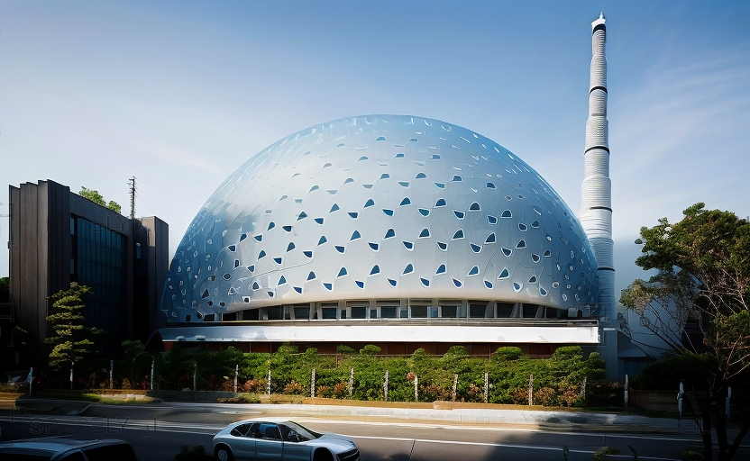
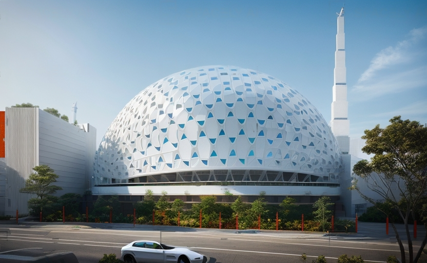

Date 2013  
Location Kosovo

This building, planned to be constructed in Kosovo, which is one of the places where the Ottoman Empire's settlement and expansion policy was most intense, takes into consideration the development scheme of traditional Ottoman architecture for mosques.
This mosque is a synthesis of a spacious plan and a central dome. Like in Ottoman mosques, the dome has an independent appearance from the rest of the structure. The tradition of a single minaret is also maintained in this mosque. The minaret also houses several doors and stairs that connect vertical and horizontal spaces. The mosque regulates its own temperature with 784 sandy glass blocks of equal size on its dome.
Modern techniques used for lighting the mosque will allow it to interact differently with the surroundings on special occasions and specific dates, breaking away from routine illumination. Spaces like the conference hall, library, and restaurant, which receive ample natural light, overlook the courtyard.




