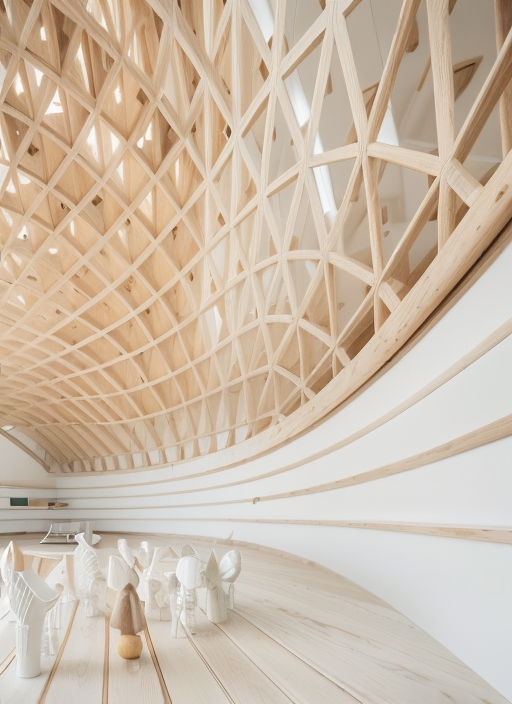
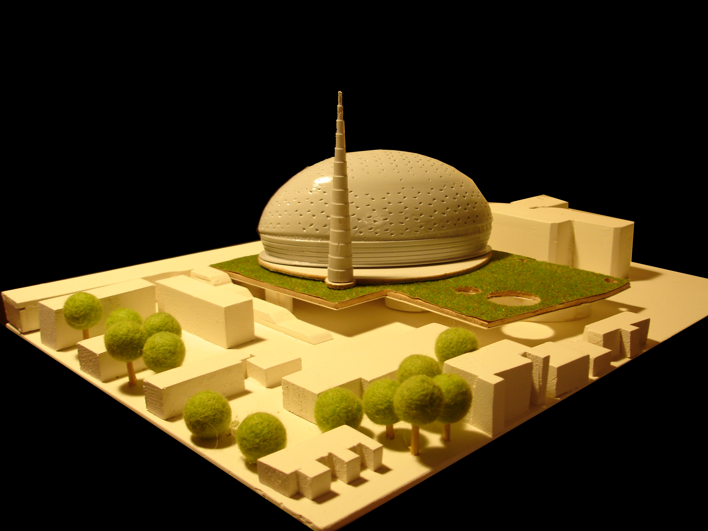
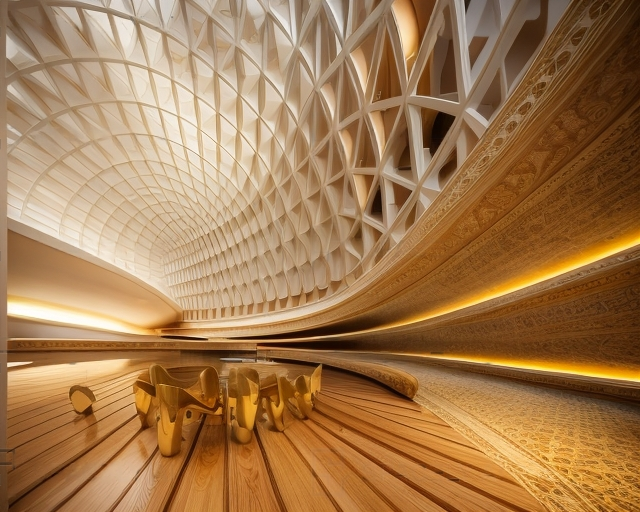
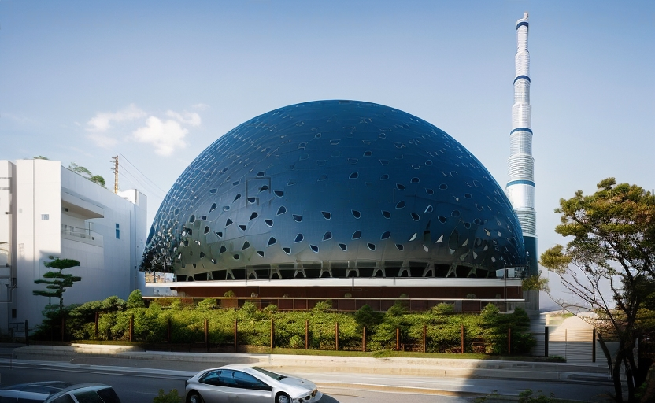

Дата 2013  
Место Косово

При планировании этой постройки в Косово, которое является одним из наиболее интенсивных мест осуществления политики османского населения и распространения на Балканах, учитывалась схема развития традиционной османской архитектуры для мечетей.
Эта мечеть - синтез просторного плана и центральной купола. Как и в османских мечетях, купол имеет независимый вид от остальной структуры. Традиция одной минареты также сохраняется в этой мечети. Минарет также содержит несколько дверей и лестниц, соединяющих вертикальные и горизонтальные пространства. Мечеть регулирует свою температуру с помощью 784 одинаковых по размеру песчаных стеклянных блоков на своем куполе.
Современные техники освещения, используемые для освещения мечети, позволят ей взаимодействовать с окружающей средой по-разному в специальные дни и в определенные даты, отходя от обычной иллюминации. Пространства, такие как конференц-зал, библиотека и ресторан, которые получают достаточно естественного света, выходят на двор.




