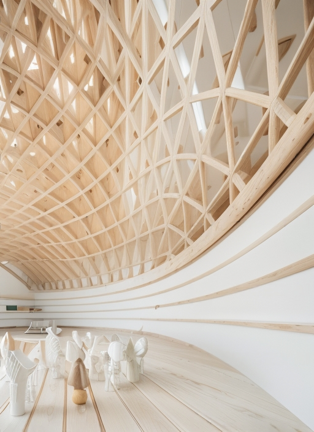
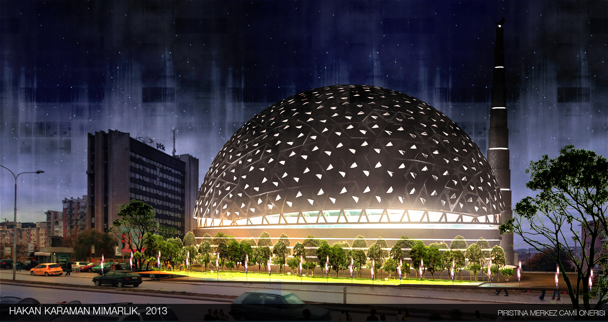
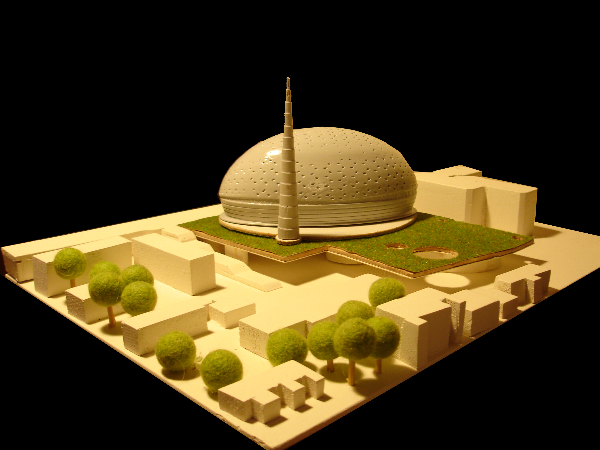
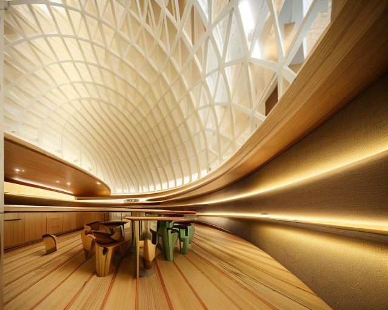
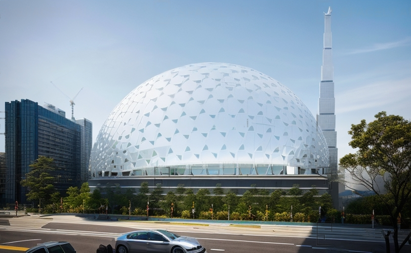
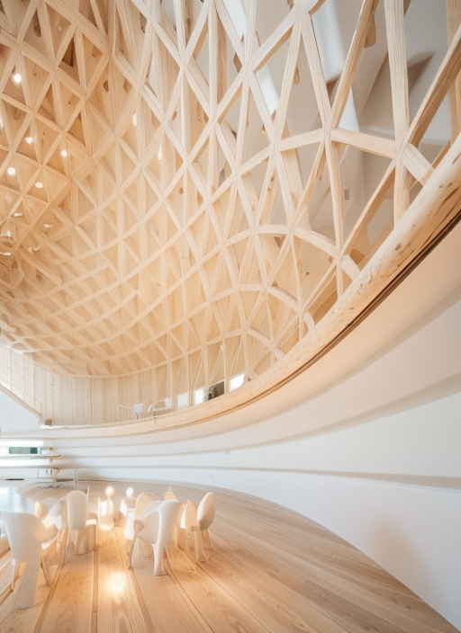
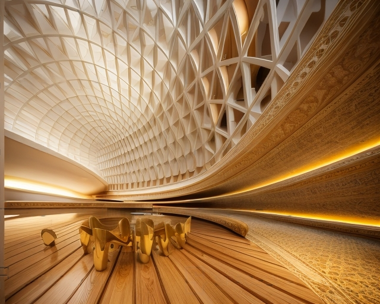
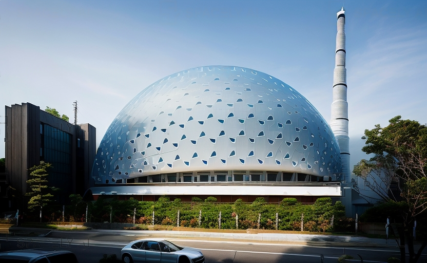
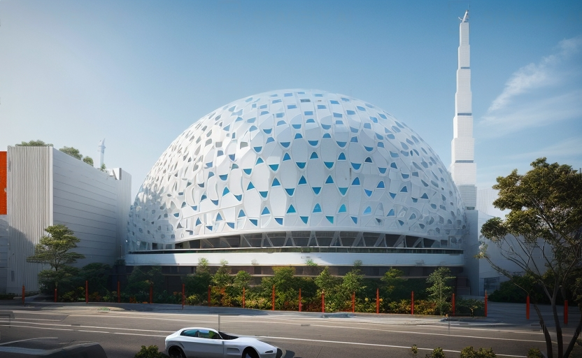
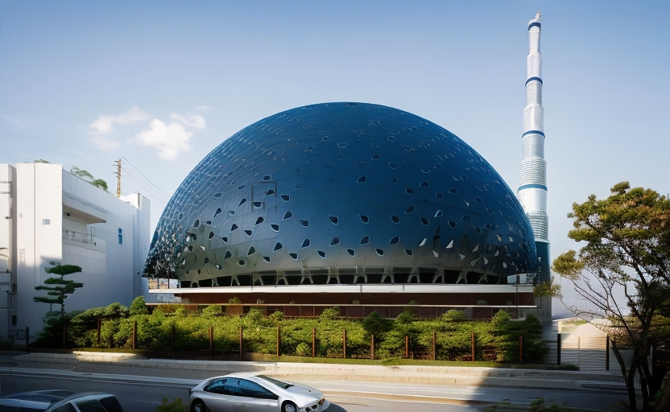

Tarih 2013   
Yer kosova  

Osmanlı’nın Balkanlardaki iskân ve yayılma politikasının en yoğun olarak yaşandığı yerlerden
biri olan Kosova’da yapılması planlanan bu yapı için geleneksel Osmanlı mimarisindeki camilerin
gelişim şeması dikkate alındı.
Bu cami, yayvan plan ile merkezî kubbenin bir sentezidir. Osmanlı camilerinde olduğu gibi,
kubbe tüm yapıdan bağımsız bir görünüme sahiptir. Tek minare geleneği bu camide de
sürdürülmektedir. Minare aynı zamanda düşey ve yatay mekânlar birbirine bağlayan kapıların ve
merdivenlerin birkaçını da barındırmaktadır. Cami kendi ısı dengesini, kubbesindeki eşit
büyüklükte 784 adet kumlu cam blok ile sağlamaktadır.
Caminin ışıklandırılması için kullanılacak modern teknikler, caminin özel günler ve belirli
tarihlerde, rutinden farklı şekilde aydınlatılarak, avlunun dışındakilerle de etkileşime geçilmesini
mümkün kılacaktır. Yoğun şekilde ışık alan konferans salonu, kütüphane ve lokanta gibi
mekânlar avluya bakmaktadır.




