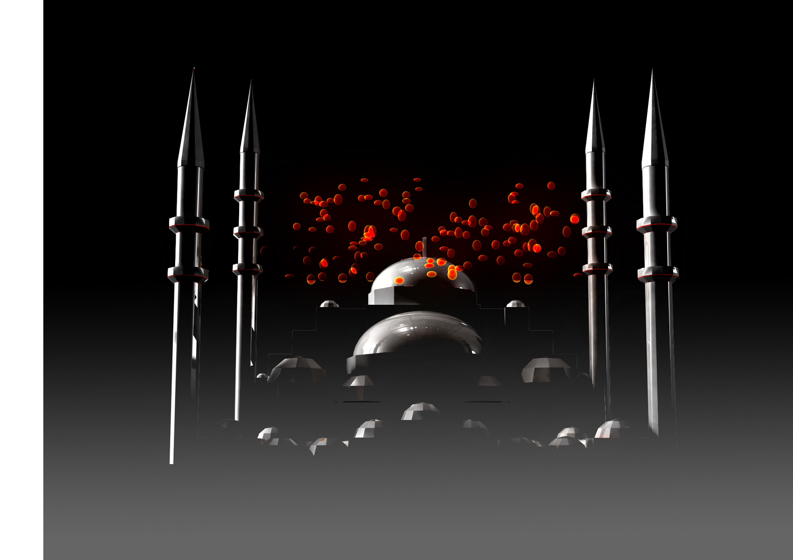
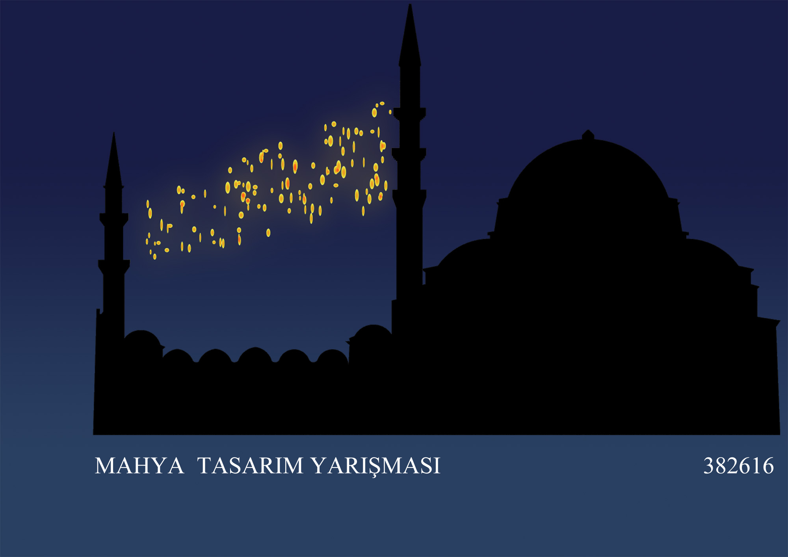
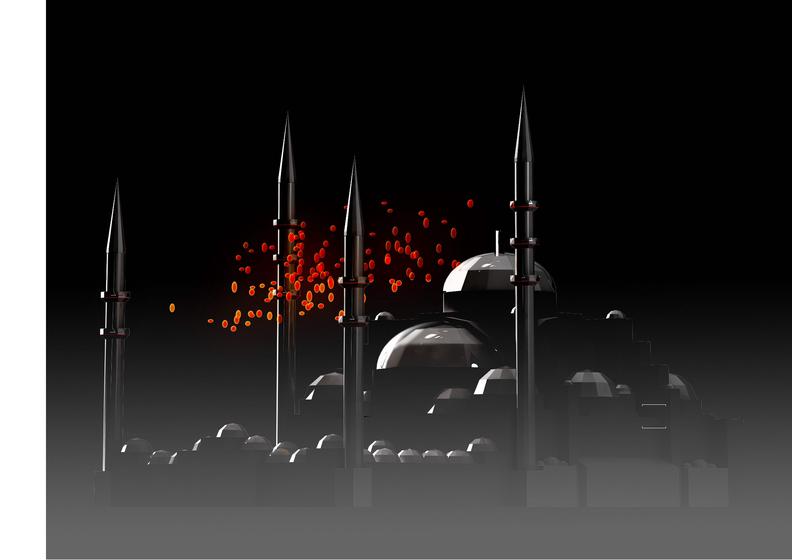

DATA 2010  
PLACE Istanbul  

Mahya is a traditional practice that dates back to times when modern technological methods did not exist. It involves hanging inscriptions or various shapes on multiple minarets of selatin mosques during the month of Ramadan, Kandil celebrations, and important events. Mahya was used to celebrate the arrival of Ramadan, convey various societal messages, and create moving shapes like the moon or stars using lanterns or candles, turning the sky into a cinema.

Our project, 16 INTERAKTİF MAHYA, was awarded the first prize in a competition initiated by Istanbul as the European Capital of Culture in 2010 to revive this tradition. It is a three-dimensional design consisting of 120 glass balloons, each weighing an average of 2-3 kg, created using the blowing technique. With a total weight of 600 kg, this Mahya is designed to be attached to four minarets.

The key features of the project are as follows:

1. INTERACTIVE: By placing photocells at the entrance and utilizing a computer language, an illusion of divine light raining down on the visitors is created.

2. TIME-DEPENDENT MAHYA: As dusk falls, the Mahya gradually starts to illuminate, offering a visual spectacle during the tarawih prayer using a computer language.

3. CINEMA IN THE SKY: Due to its three-dimensional structure, it is possible to write specific patterns and inscriptions in the form of objects.




