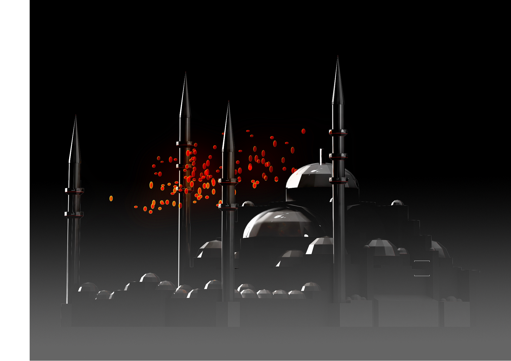

ДАТА: 2010  
МЕСТО: Стамбул

Махья - это традиционная практика, которая возникла во времена, когда не было современных технологических методов. Она заключается в подвешивании надписей или различных форм на нескольких минаретах селатинских мечетей во время месяца Рамадан, празднования Кандиля и важных событий. Махья использовалась для отмечания прихода Рамадана, передачи различных общественных сообщений и создания движущихся форм, таких как луна или звезды, с помощью фонарей или свечей, превращая небо в кинотеатр.

Наш проект "ИНТЕРАКТИВНАЯ МАХЬЯ" был удостоен первого места в конкурсе, инициированном Стамбулом в качестве Европейской столицы культуры в 2010 году, чтобы оживить эту традицию. Это трехмерное конструктивное решение, состоящее из 120 стеклянных воздушных шаров, каждый из которых весит в среднем от 2 до 3 кг, созданных методом дувки. Общий вес этой махьи составляет 600 кг, и она предназначена для крепления к четырем минаретам.

Основные характеристики проекта следующие:

1. ИНТЕРАКТИВНАЯ: Посредством установки фотоэлементов у входа и использования компьютерного языка создается иллюзия божественного света, падающего на посетителей.

2. МАХЬЯ, ЗАВИСИМАЯ ОТ ВРЕМЕНИ: При наступлении сумерек махья постепенно начинает светиться, предлагая визуальное зрелище во время таравих-намаза с использованием компьютерного языка.

3. КИНО В НЕБЕ: Благодаря своей трехмерной структуре возможно писать определенные узоры и надписи в форме объектов.




