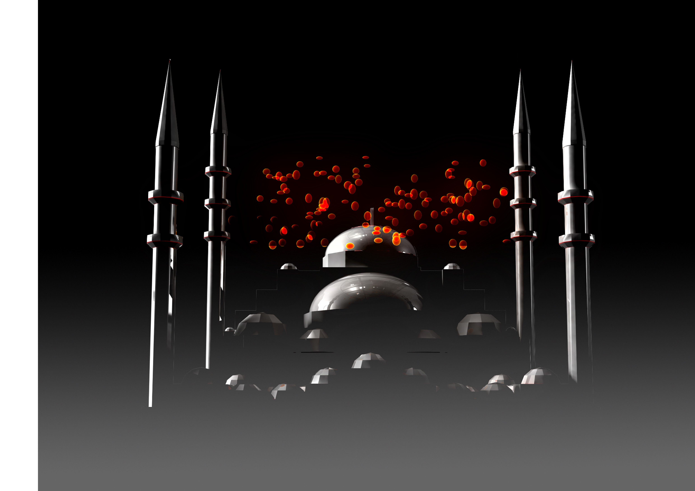
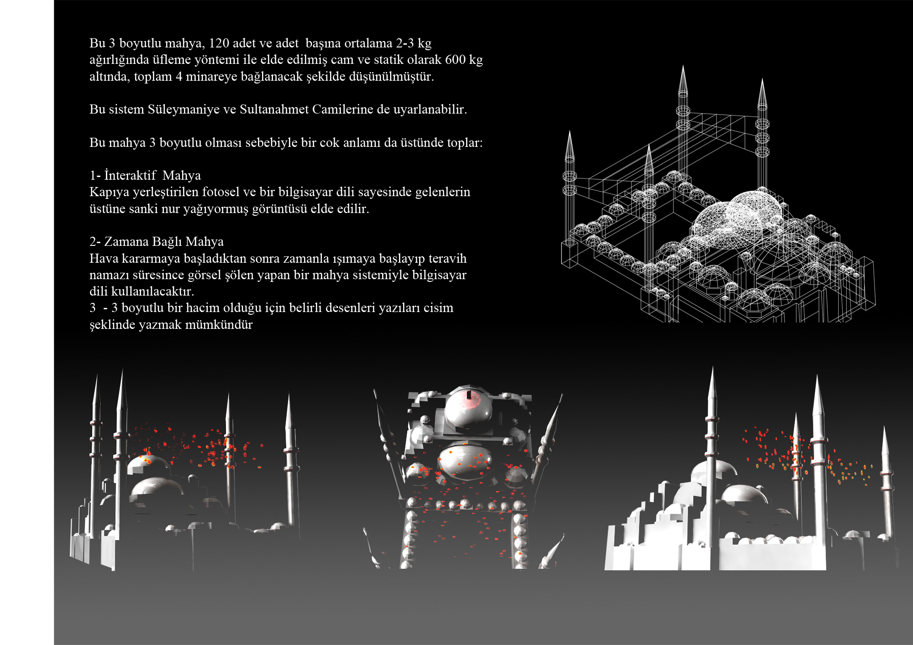
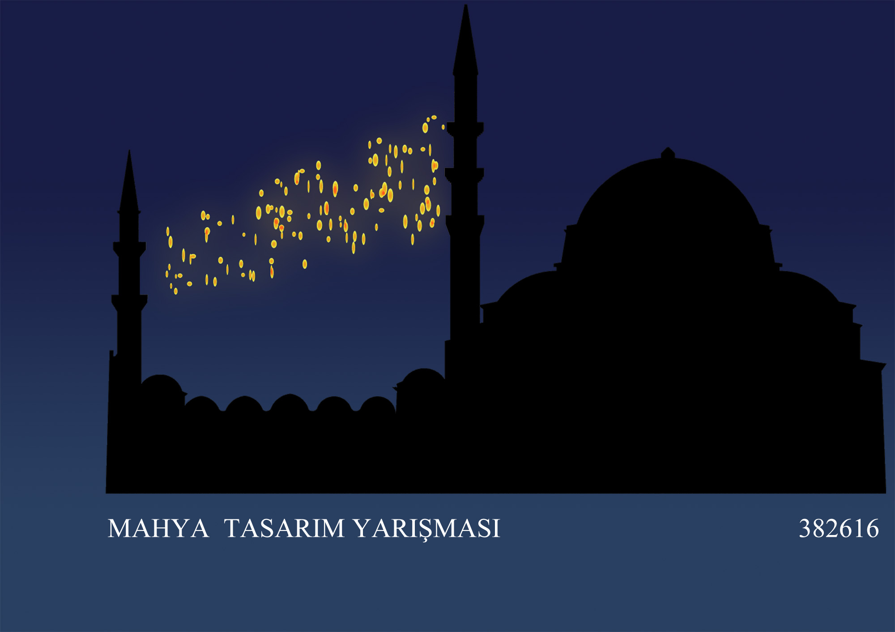

TARİH: 2010  
YER: İstanbul

Mahya günümüzdeki teknolojik yöntemlerin olmadığı
devirlerde Ramazan aylarında, kandillerde, önemli olaylarda
birden çok minareye sahip selatin camilere asılan yazılar
yahut muhtelif şekillerdi. Mahya sayesinde Ramazan’ın
gelişi kutlanır, çeşitli toplumsal mesajlar verilir
yahut gezdirme mahya denilen yöntemle kandillerle yahut
fenerlerle oluşturulmuş ay, yıldız gibi şekiller hareket
ettirilerek gökyüzü adeta bir sinema salonuna çevrilirdi.
İstanbul 2010 Avrupa Kültür Başkenti Ajansı tarafından bu
geleneği canlandırmak adına açılan yarışma neticesinde projemiz
birincilik ödülüne layık görüldü. Bu üç boyutlu tasarıma sahip
her biri ortalama 2-3 kg ağırlığında, üfleme yöntemi ile elde
edilmiş 120 adet cam balondan oluşmaktadır. Statik olarak 600
kg olan bu mahya, 4 minareye bağlanacak şekilde tasarlanmıştır.
Özelliklerini şu şekilde sıralamak mümkündür:

1. İNTERAKTİF
   Kapıya yerleştirilen fotosel ve bir bilgisayar dili
   sayesinde gelenlerin üstüne sanki nur yağıyormuş
   görüntüsü elde edilir.
2. ZAMANA BAĞLI MAHYA
   Hava kararmaya başladıktan sonra zamanla ışımaya
   başlayıp teravih namazı süresince görsel şölen yapan
   bir mahya sistemiyle bilgisayar dili kullanılacaktır.
3. GÖKYÜZÜNDEKİ SİNEMA
   Üç boyutlu bir hacim olduğu için belirli desenleri
   yazıları cisim şeklinde yazmak mümkündür.




