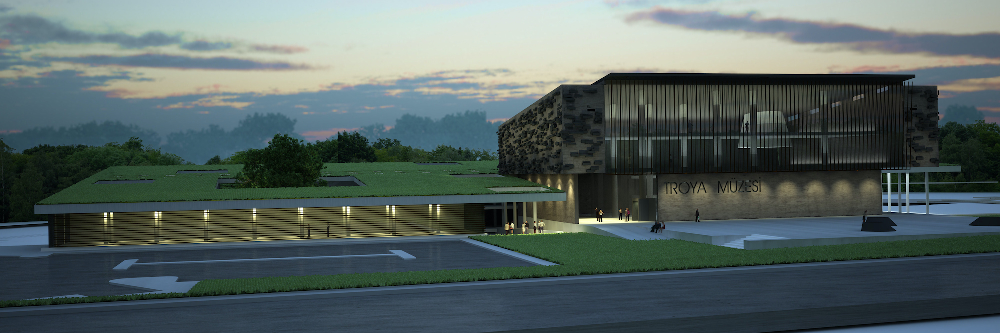
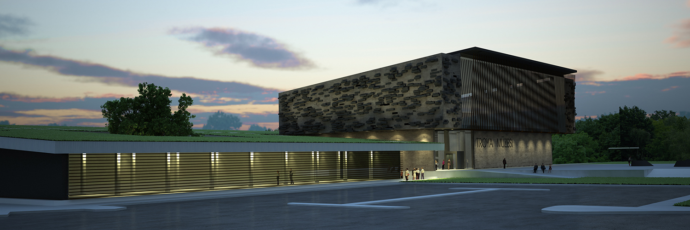

Date 2012  
Location Çanakkale  

This project was realized for a national competition organized by the Ministry of Culture and Tourism, General Directorate of Cultural Assets and Museums. In the project, the structure is positioned along the East-West axis, inspired by the struggle between the Trojans and the Achaeans as narrated in the Homeric epics. A wall series following the road connected with bridges through the necropolis not only emphasizes the ecosystem of the region but also contains scenes from the Iliad epic. All spaces in the project, including exhibition areas, sales and event spaces, management offices, rest and service areas, research and education centers, conference halls, and storage rooms, are located in a way that they remain between the ground that is torn apart like a shell. The complex is designed as a space where people will always gather. The aim is for visitors to come here not only to see the exhibited artworks but also to participate in art workshops, introduce their children to art, and have a pleasant time. The time spent in the museum transforms visitors into a part of it.




