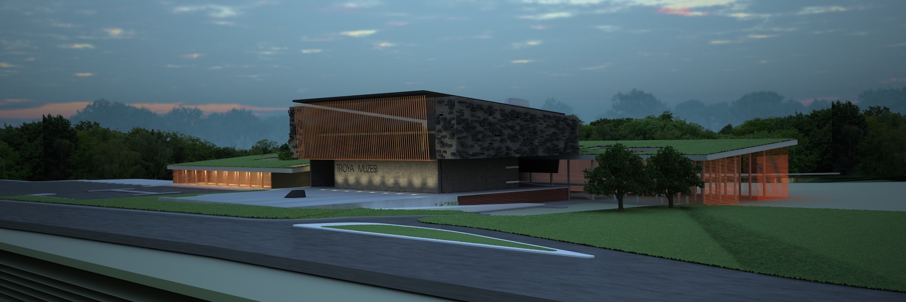
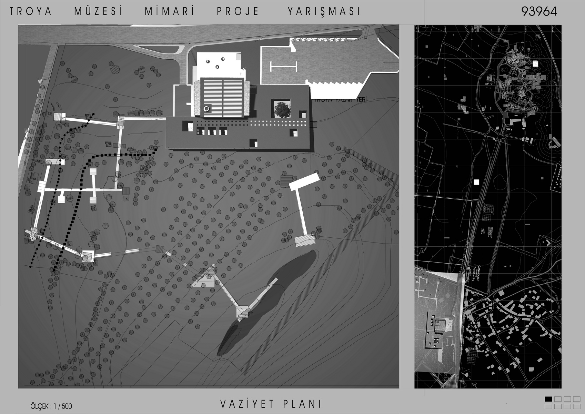

Дата 2012  
Место Чанаккале

Этот проект был реализован для национального конкурса, организованного Министерством культуры и туризма, Генеральным управлением по культурным ценностям и музеям. В проекте структура размещена вдоль восток-западной оси, вдохновленной борьбой Троянцев и Ахейцев, как описано в гомеровских эпосах. Серия стен, идущая по дороге, соединенной мостами через некрополь, не только подчеркивает экосистему региона, но и содержит сцены из эпоса "Илиада". Все пространства в проекте, включая выставочные залы, торговые и мероприятий, административные офисы, зоны отдыха и обслуживания, исследовательские и образовательные центры, конференц-залы и складские помещения, расположены так, чтобы они оставались между разорванной, как ракушка, землей. Комплекс разработан как место, где люди всегда будут собираться. Целью является привлечение посетителей сюда не только для просмотра выставленных произведений искусства, но и для участия в мастер-классах по искусству, знакомства своих детей с искусством и приятного проведения времени. Время, проведенное в музее, превращает посетителей в его часть.




