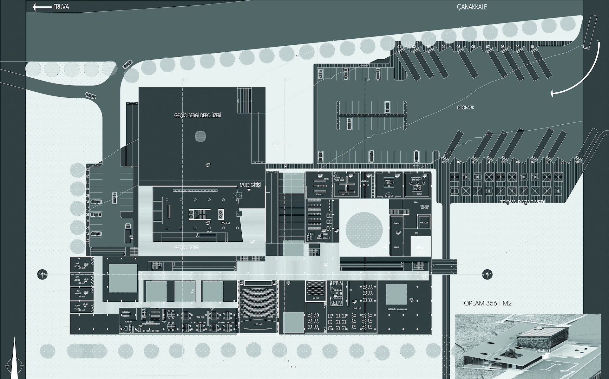
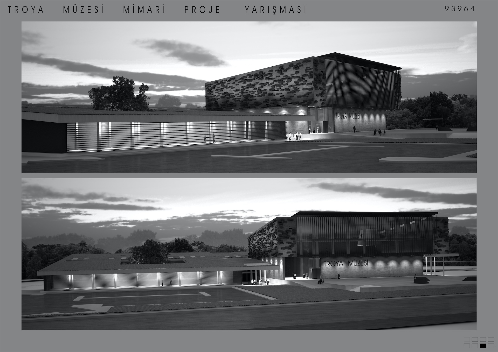
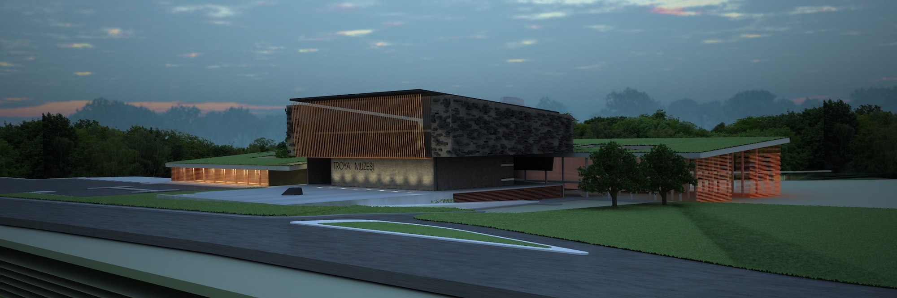
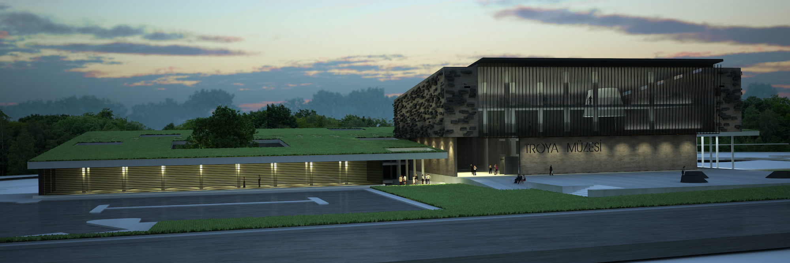
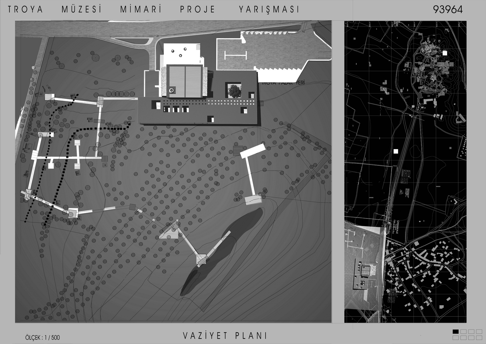
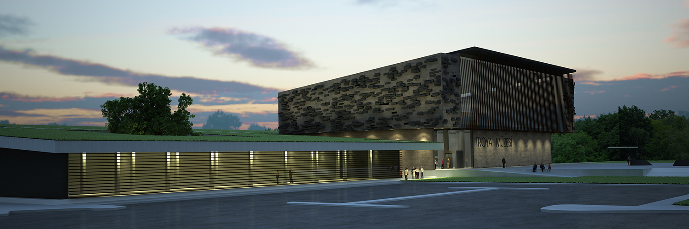

Tarih 2002  
Yer Çanakkkale

Bu proje, Kültür ve Turizm Bakanlığı Kültür Varlıkları ve Müzeler Genel Müdürlüğünce
düzenlenen ulusal yarışma için hayata geçirildi.
Projede yapı, Homeros destanlarında anlatılan Truvalılar ile Akalar arasındaki mücadeleye
istinaden Doğu-Batı aksına yerleştirilmiştir. Nekropol üzerinden köprülerle bağlanılan yolu takip
eden bir duvar dizisi, hem bu bölgenin ekosistemine vurgu yapar hem de İlyada destanından
sahneler içermektedir.
Projede yer alan tüm mekânlar; sergi alanları, satış ve etkinlik alanları, yönetim ofisleri, dinlenme
ve servis alanları, araştırma ve eğitim merkezleri, konferans salonları ve depolar, bu aks
üzerinde, bir kabuk gibi yırtılan toprağın altı ve üstü arasında kalacak şekilde yer almıştır.
Yapı kompleksi, insanların her zaman buluşacağı bir mekân olarak düşünülmüştür. İnsanların
buraya sadece sergilenen eserleri görmek amacıyla değil, düzenlenecek sanat atölyelerine
katılmak, çocuklarını sanatla tanıştırmak ve keyifli vakit geçirmek için de gelmeleri
amaçlanmaktadır. Müzede geçen zaman, ziyaretçileri de buranın bir parçasına
dönüştürmektedir.




