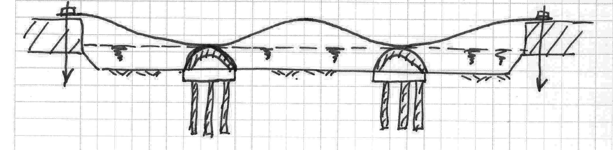
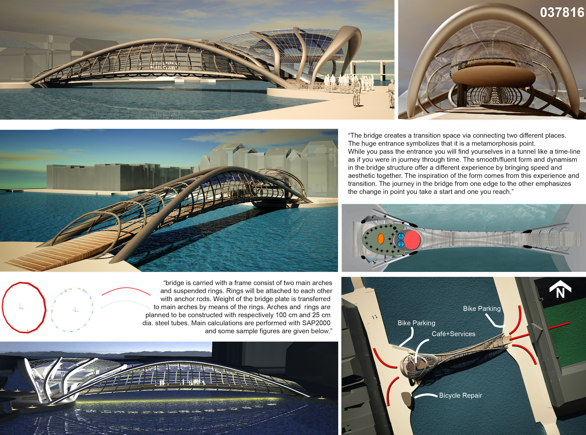
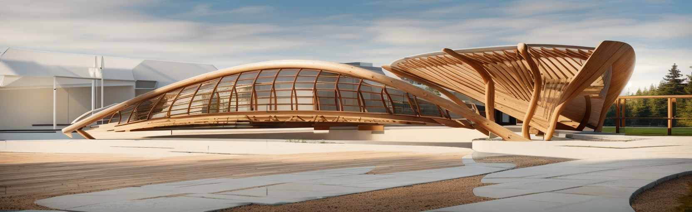

This bridge project is carried out in Germany's Saxony, Brandenburg,
It was designed for the Spree River passing through the states of Berlin and the Czech Republic.
In this project where the carriers are under water and soil, spoon
steel bridge span in the form of built-in and symmetrical
is passing. It is shaped like two spoons facing each other.
The elegant bridge meets the water through the stairs,
It continues with a balanced platform. from water distance
The platform is 1-2 cm high; concerts, sports activities,
It will be used for events such as cocktails and city residents
An area where they can gain different spatial experiences
will receive the service.




