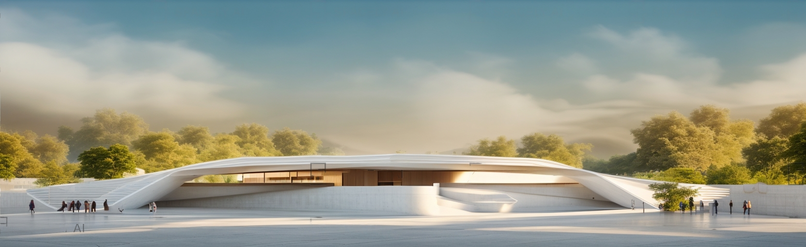
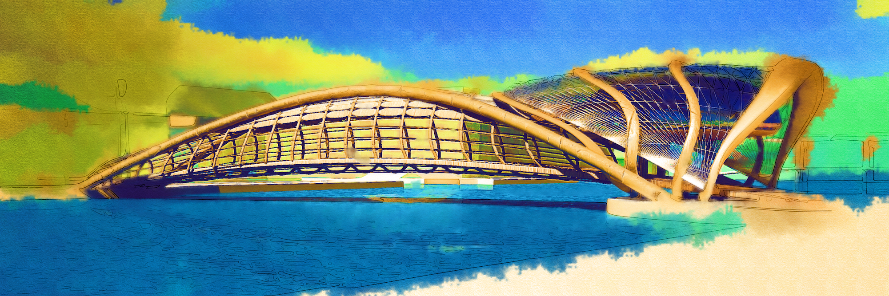

Этот проект моста реализуется в немецкой Саксонии, Бранденбурге.
Он был спроектирован для реки Шпрее, проходящей через земли Германии и Чехии.
В этом проекте, где носители находятся под водой и почвой, проходит
стальной пролет моста. Он имеет форму двух ложек, обращенных друг к другу.
Элегантный мост встречается с водой по лестнице.
Это продолжается со сбалансированной платформой. с расстояния воды
Платформа высотой 1-2 см.  
Она будет использоваться для таких мероприятий, как коктейли и выступления жителей города.




