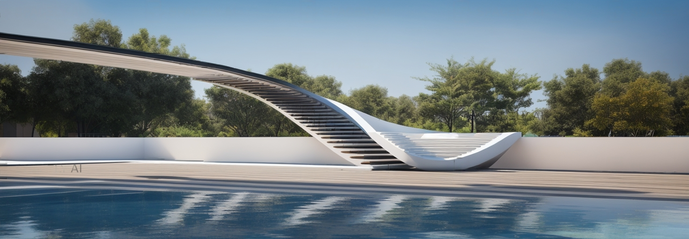
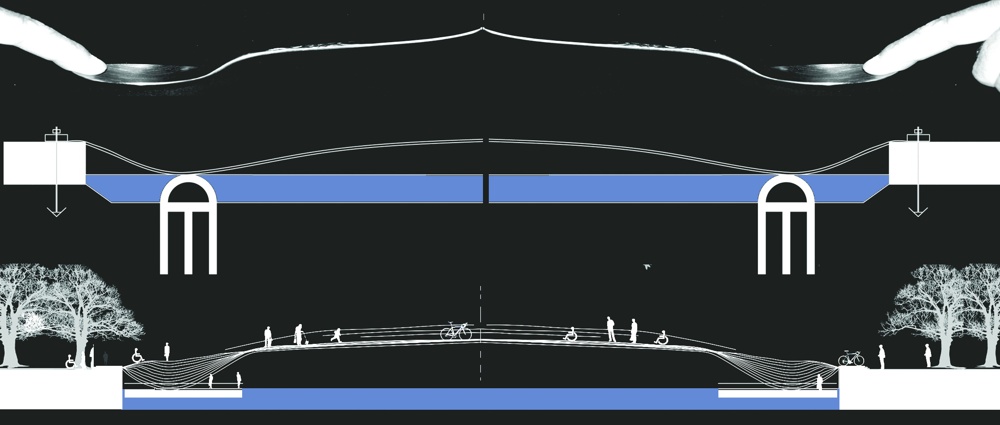
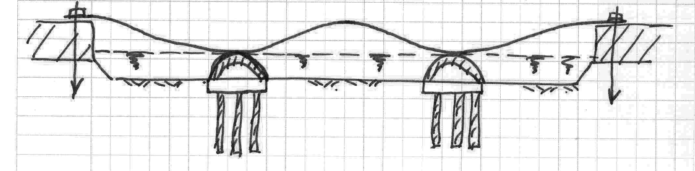
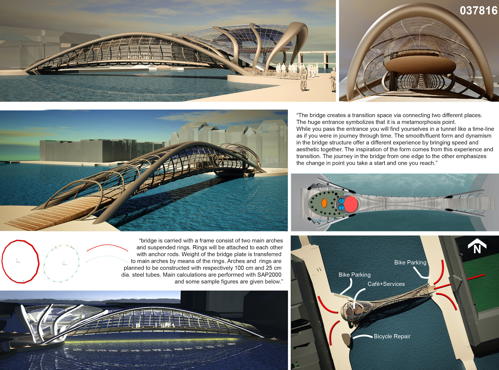
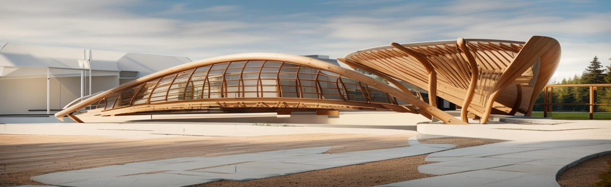
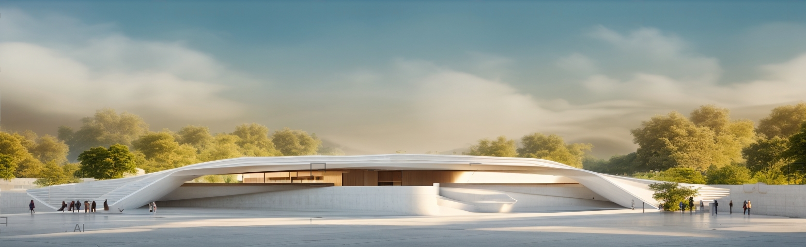
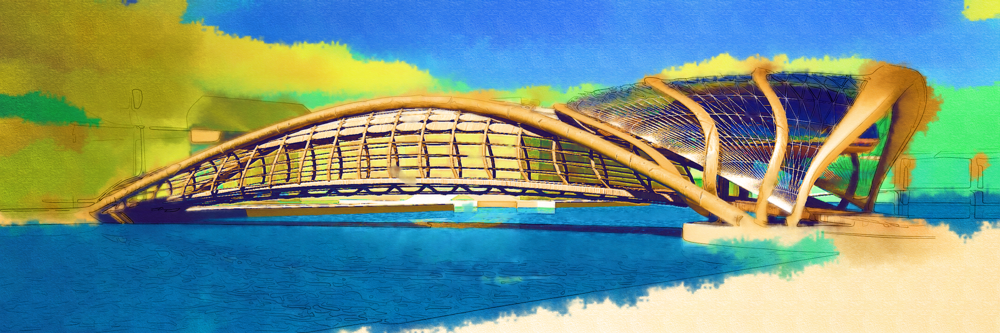

Bu köprü projesi, Almanya’nın Saksonya, Brandenburg,
Berlin eyaletleri ile Çekya’dan geçen Spree Nehri için tasarlandı.
Taşıyıcıların su ve toprağın altında olduğu bu projede, kaşık
formundaki çelik köprü açıklığı ankastre ve simetrik olarak
geçmektedir. Birbirine ters duran iki kaşık şeklindeki bu
zarif köprünün merdivenler aracılığıyla su ile buluşması,
dengeli bir platform ile devam etmektedir. Su mesafesinden
1-2 cm yüksekte olan platform; konser, sportif faaliyetler,
kokteyl gibi etkinlikler için kullanılacak ve kent sakinleri
için farklı mekânsal tecrübeleri edinecekleri bir alan
hizmeti görecektir.




