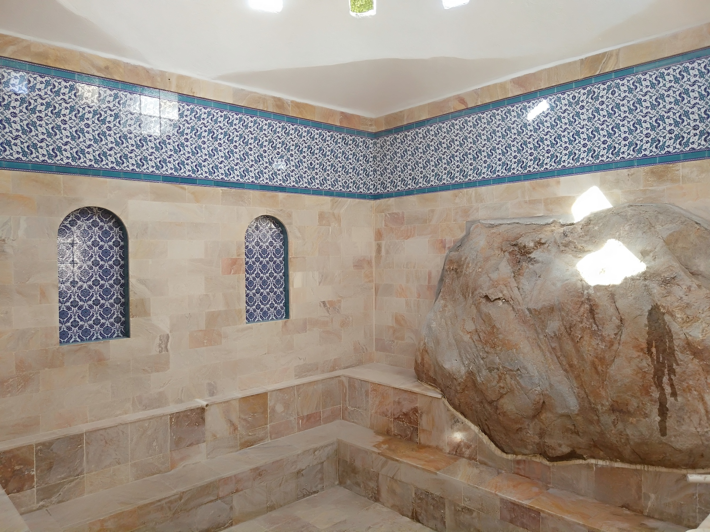
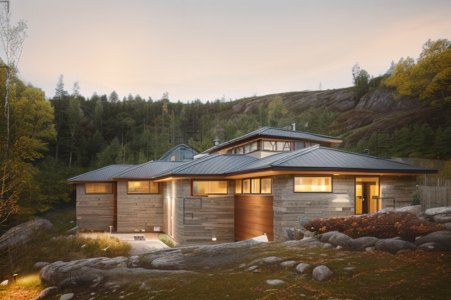

DATE: 2017  
LOCATION: Kütahya - Emet

The information about the healing properties of the spring waters in the area originated from observations of various animals with illnesses getting better after coming here.

The waters are collected through captations. The water temperature ranges from 38 to 48 degrees Celsius from nine different sources. A special water known as Aşıkbaylan (a type of dark red viscous mud) is also used.

The project is based on the local architecture of the region. Details from the architecture of the village were incorporated with specific angles. The bath is made of wood, travertine stone, and concrete. Its square form and repetition are in harmony with the land.




