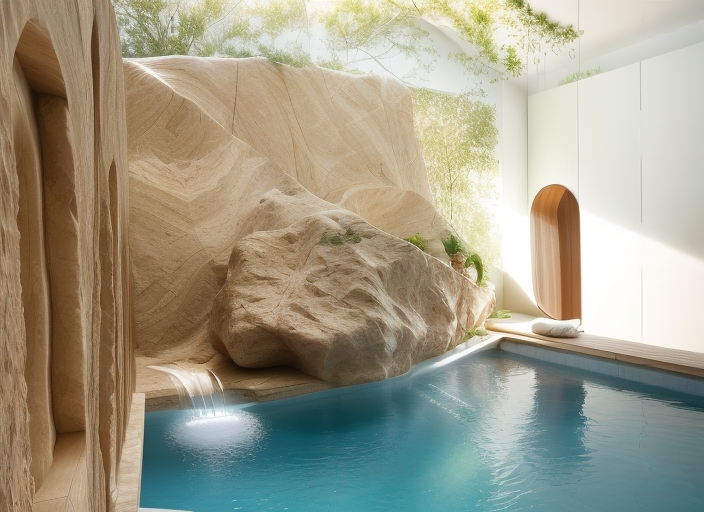
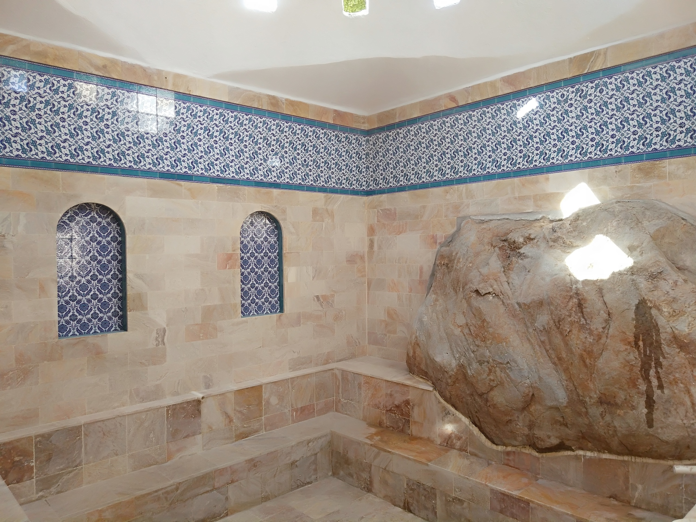
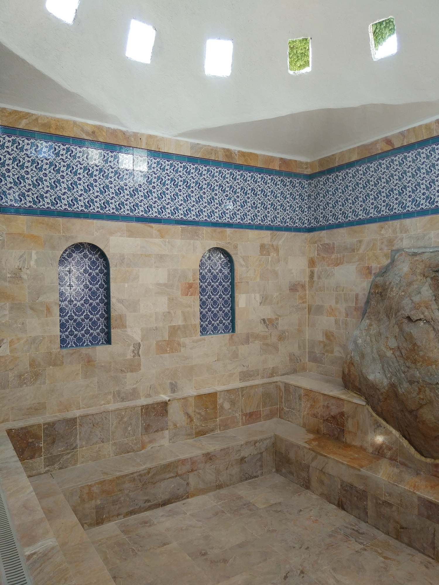
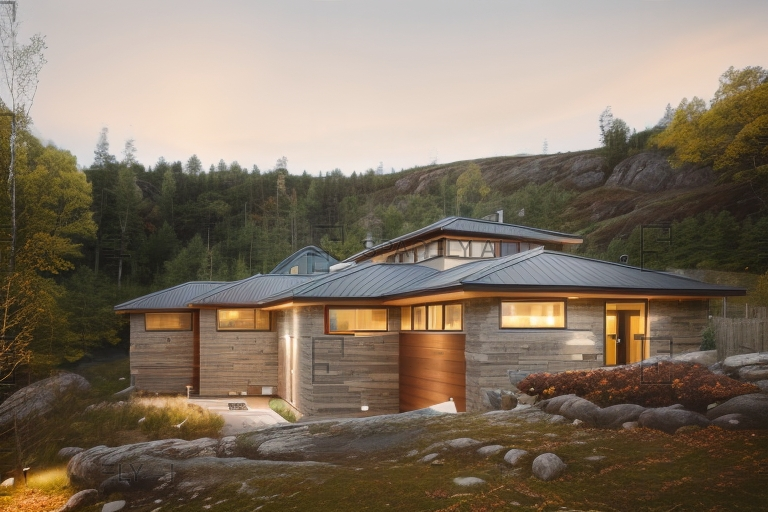
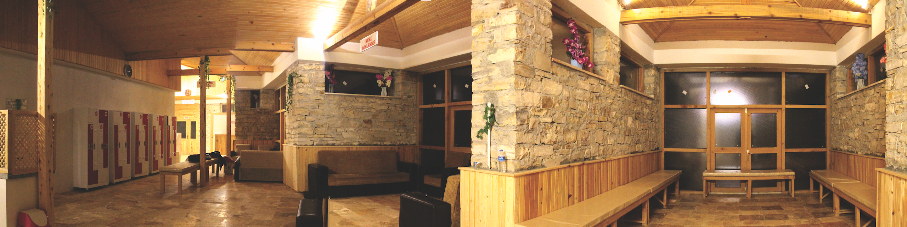

Дата: 2017  
Место: Кутахия - Эмет  

Новая баня Йениджек с лечебными источниками
Информация о том, что источники на месте считаются целебными, основана на наблюдениях, что животные с различными заболеваниями выздоравливают после посещения этого места.

Вода собирается с помощью каптажей. Температура воды варьируется от 38 до 48 градусов по Цельсию из девяти источников. Особая вода, известная как Ашикбайлан (вид густой красной грязи), также используется.

В проекте была использована местная архитектура. Детали архитектуры деревни были использованы с определенными углами. Баня состоит из дерева, камня травертина и бетона. Квадратная форма и ее повторение соответствуют участку.




