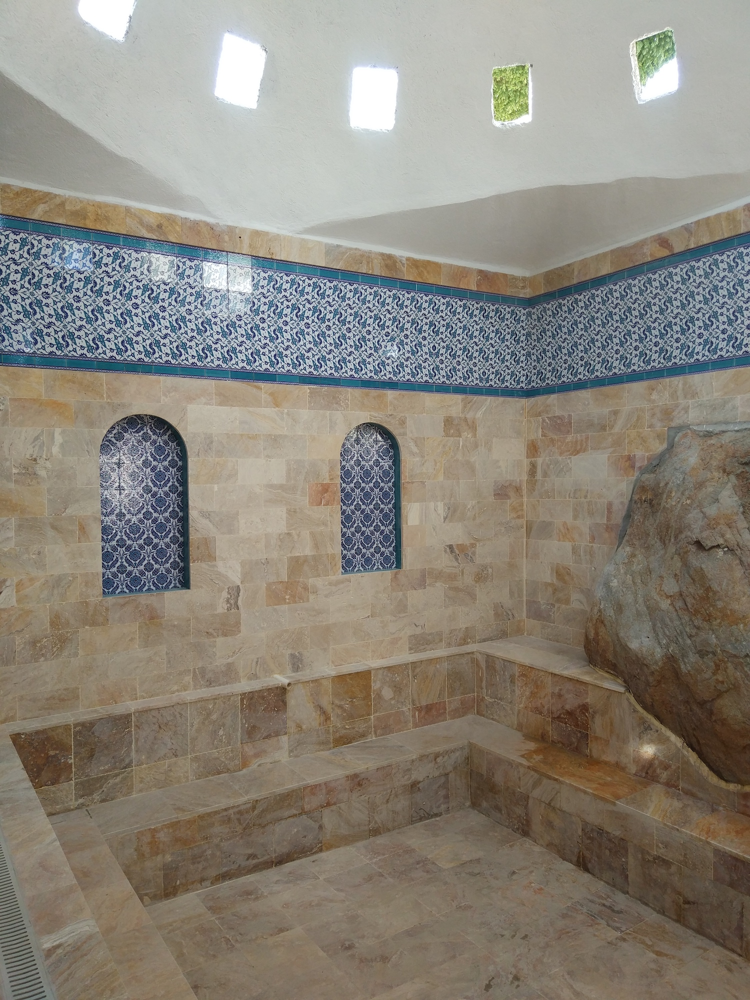
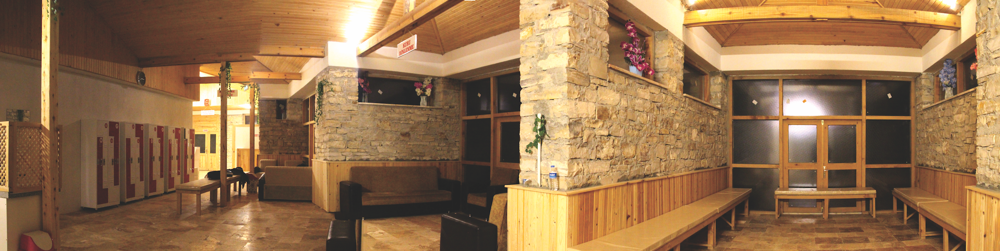

TARİH: 2017  
YER: Kütahya - Emet

Sahadaki kaynak sularının şifalı olduğu bilgisi
çeşitli hastalıklara sahip hayvanların buraya
geldikten sonra iyileştiklerinin görülmesi üzerine olmuştur.
Sular kaptajlar vasıtası ile toplanmıştır. Su
sıcaklığı 9 kaynaktan 38 ila 48 derece arasındadır.
Aşık bağlayan (bir çeşit koyu kıvamlı kırmızı bir
çamur) özel bir sudur.
Projede yörenin mimarisi temel alındı. Köydeki
mimarinin beli açılardan detayları kullanıldı. Hamam
ahşap taş traverten ve betondan oluşmaktadır. Kare
formu ve bunun tekrarı arsayla ilişkiye uygundur.




