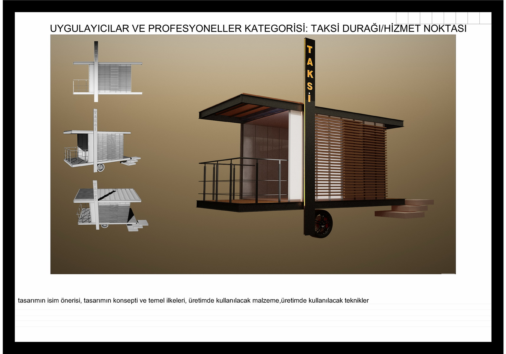

Being selected as a Taxi Innovation Award Finalist signifies recognition of your creativity and dedication to environmentally friendly and sustainable taxi designs. Congratulations to you and your design as part of this prestigious competition! Here are some key details about your finalist design:

Design presents an innovative approach to making taxi transportation more environmentally friendly and sustainable in the future. This design aims to minimize the environmental impact by promoting the use of eco-friendly materials. Additionally, the ability to use the taxi as a portable station is a significant feature that sets your design apart from other competitors. This feature enables you to quickly and flexibly respond to the changing needs of users and cities.




