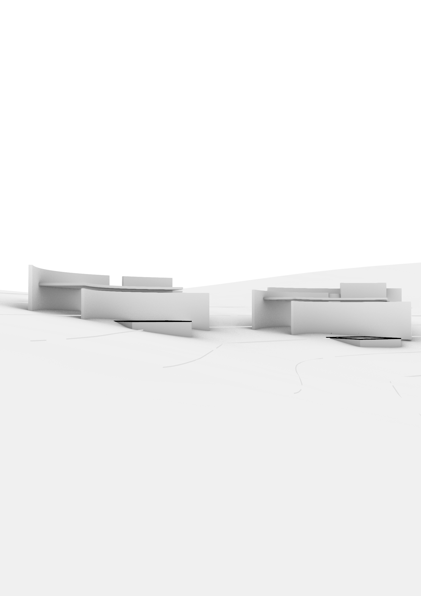
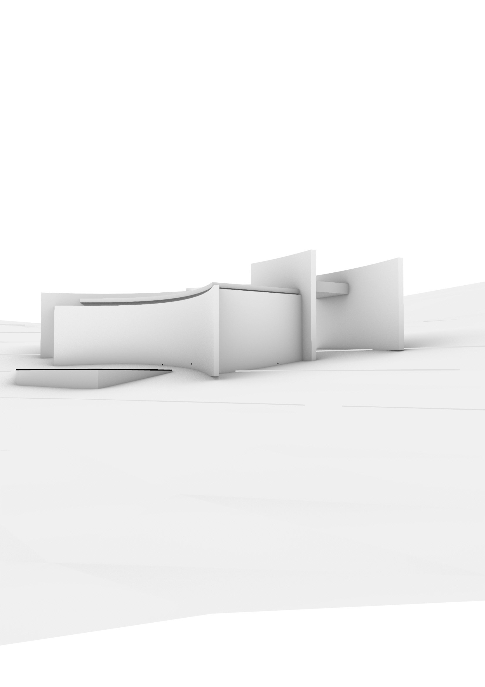
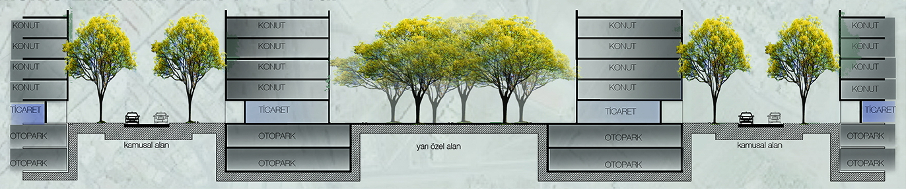
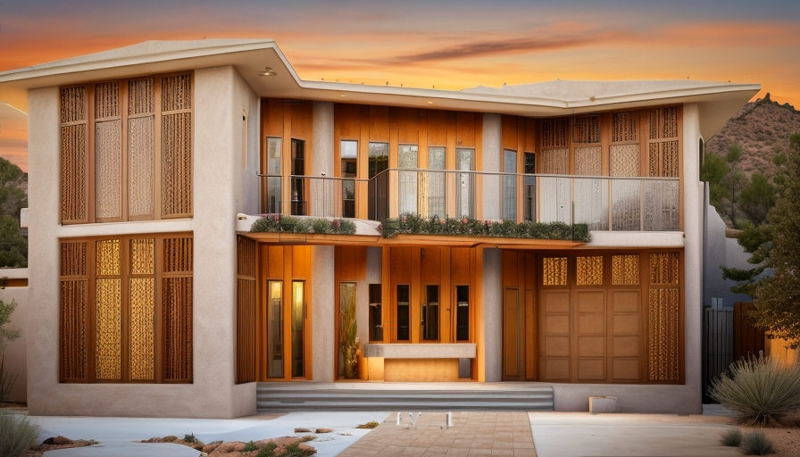
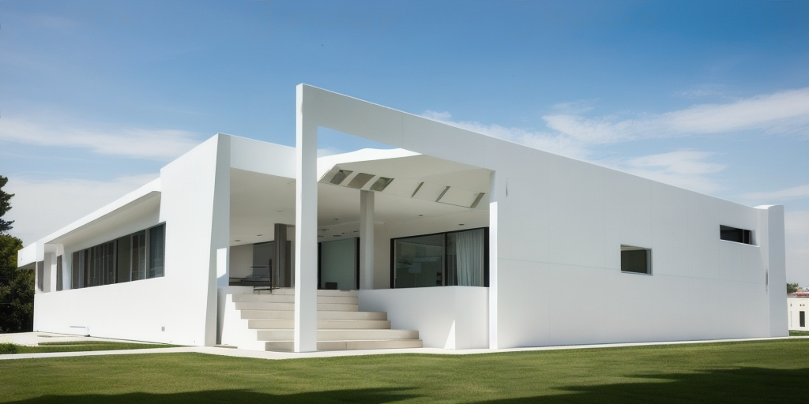
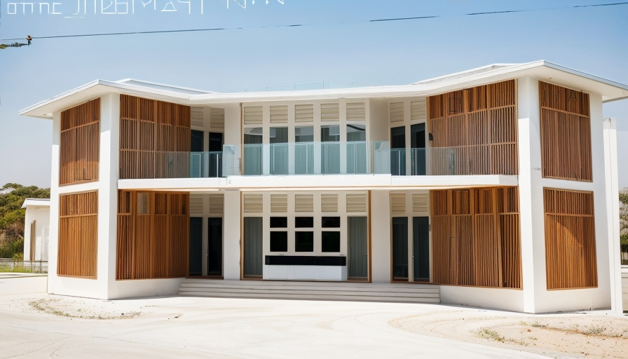
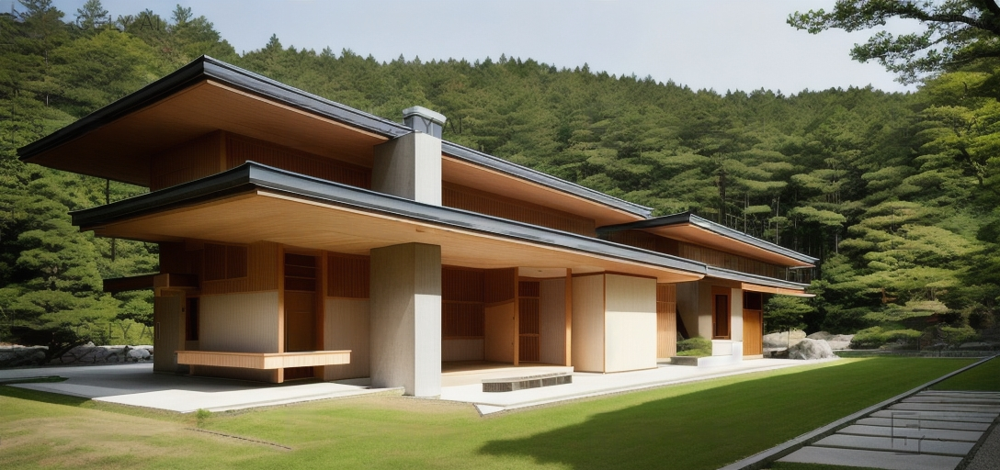
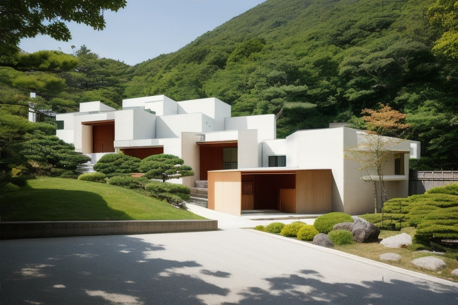
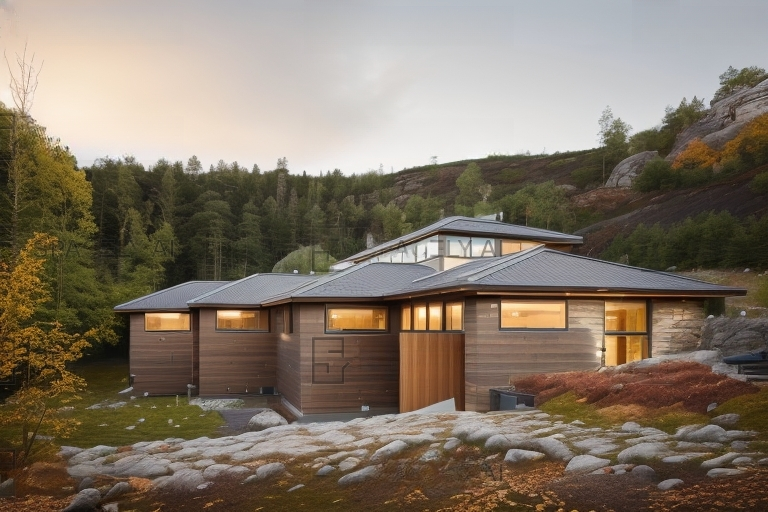
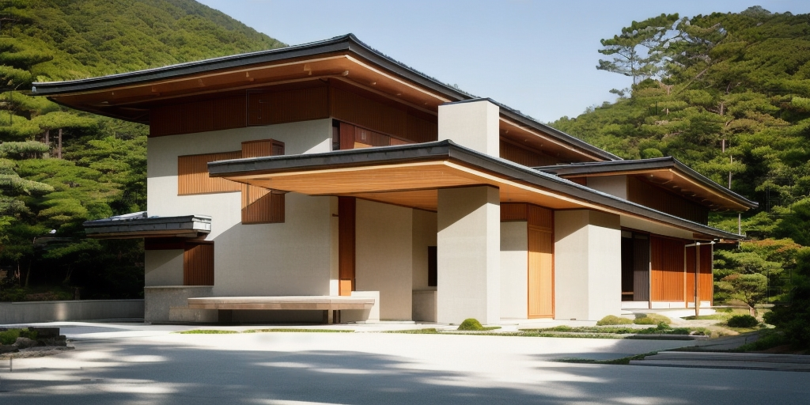

Hakan Karaman Architecture is renowned for its residential projects that combine ecological, aesthetic, and safety considerations. Many residential projects designed by Hakan Karaman Architecture are tailored to meet modern needs while maintaining harmony with nature.

These projects emphasize the use of eco-friendly materials and the integration of sustainable energy systems, such as the use of renewable energy sources. At the same time, architectural solutions always pay attention to aesthetics, attracting attention with their modern and beautiful designs.

Security also remains a priority in these projects. Residential complexes designed by Hakan Karaman Architecture utilize modern security systems, including cameras, access control systems, and smart technologies to ensure the peace of mind of residents.
Hakan Karaman Architecture respects the principles of sustainability and creates numerous projects, offering people a modern, ecological, and safe lifestyle. These projects are designed to meet the needs of those who aspire to live in harmony with nature and enjoy all the benefits of modern living.




