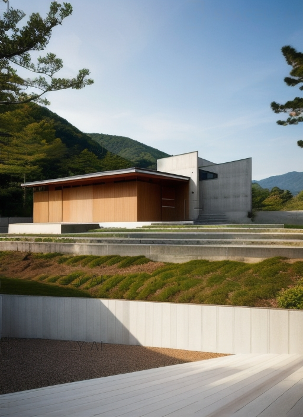
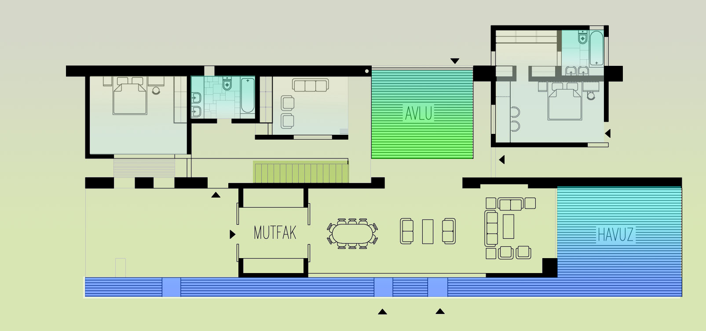
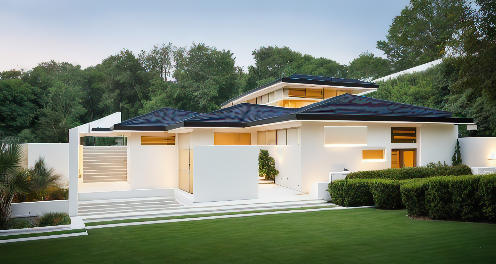
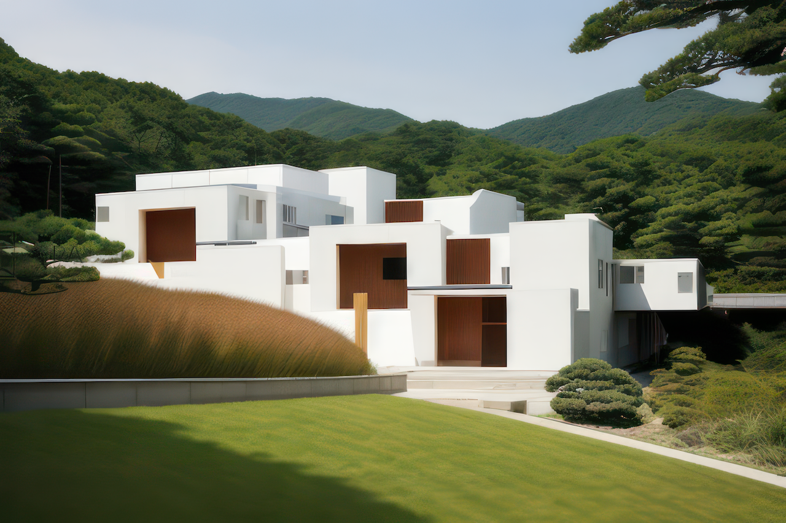
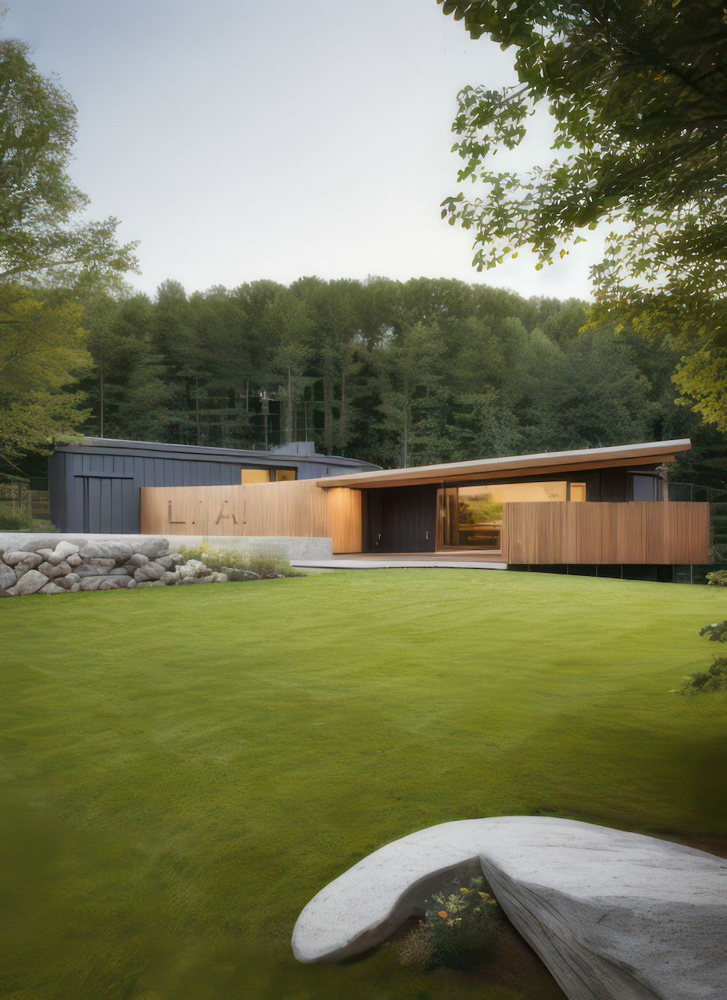
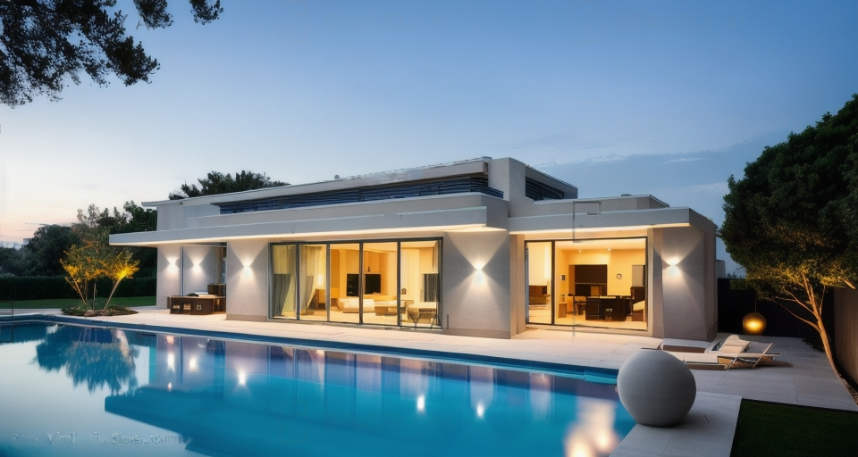
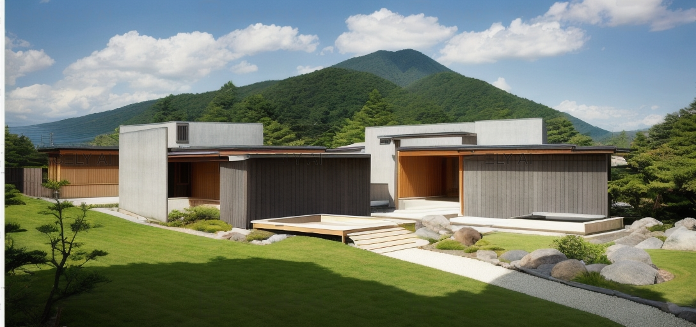
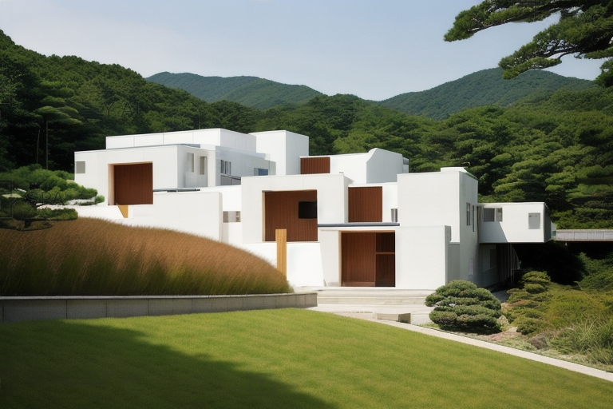
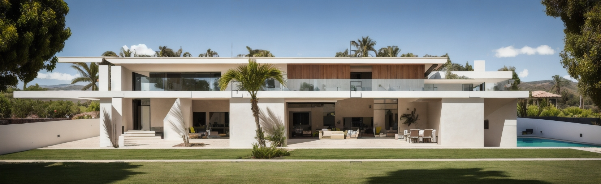

Хакан Караман, признанный дизайнер жилых домов, известен своими проектами, объединяющими экологичность, эстетику и безопасность. Множество жилых проектов, разработанных архитектурным бюро Хакана Карамана, спроектированы так, чтобы соответствовать современным потребностям, сохраняя при этом гармонию с природой.

В этих проектах акцент делается на экологичных материалах и интеграции устойчивых систем энергоснабжения, таких как использование возобновляемых источников энергии. При этом архитектурные решения всегда придают внимание эстетике, привлекая внимание своим современным и красивым дизайном.

Безопасность также остается приоритетом в этих проектах. В жилых комплексах, спроектированных Хаканом Караманом, используются современные системы безопасности, включая камеры, системы контроля доступа и умные технологии для обеспечения спокойствия жильцов.

Хакан Караман с уважением относится к принципам устойчивости и создает множество проектов, предлагая людям современный, экологичный и безопасный образ жизни. Эти проекты призваны удовлетворить потребности тех, кто стремится жить в гармонии с природой и воспользоваться всеми преимуществами современной жизни.




