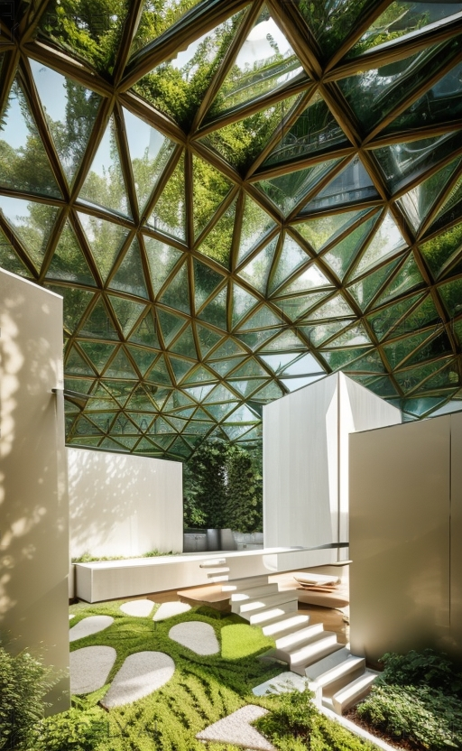

The hotel room was elegantly designed with a comfortable king-size bed as its
centerpiece. Soft, neutral colors adorned the walls, creating a tranquil
atmosphere. A small sitting area by the window offered a picturesque view of the
city skyline. The room was equipped with modern amenities, including a
flat-screen TV and a minibar. The ensuite bathroom featured sleek, contemporary
fixtures and a spacious shower.




