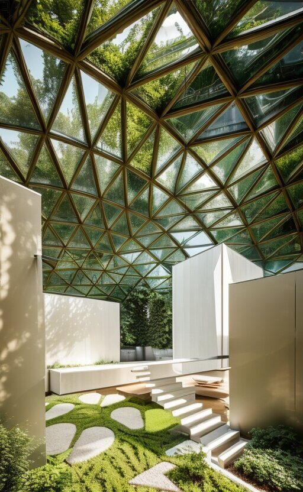
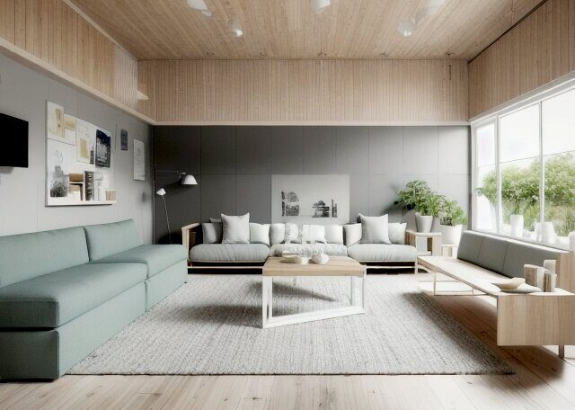
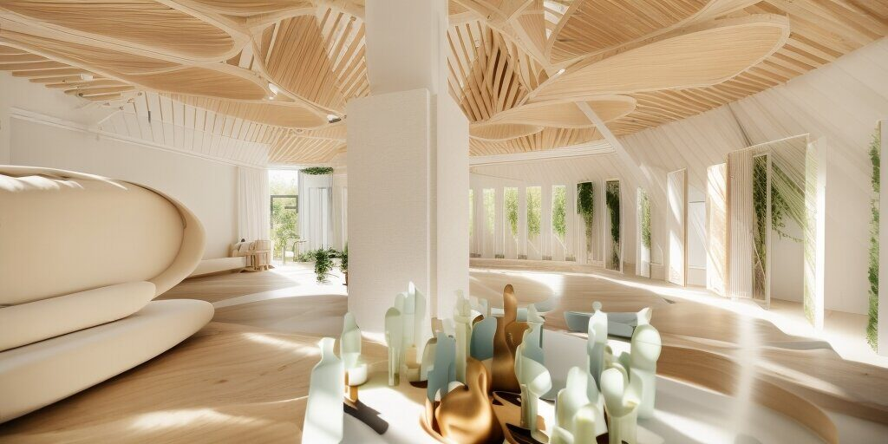
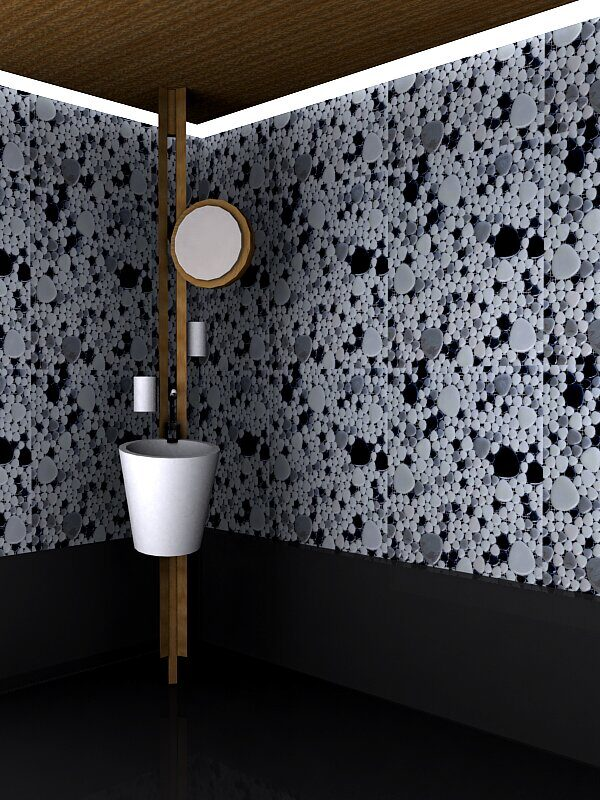

Otel odası konforlu bir kral yatakla zarif bir şekilde tasarlanmıştır.
merkez parçası. Yumuşak, nötr renkler duvarları süsleyerek huzur verici bir ortam yarattı atmosfer.

Pencere kenarındaki küçük bir oturma alanı pitoresk bir manzara sunuyordu.
şehrin silueti. Oda, modern olanaklarla donatılmıştı;
düz ekran TV ve minibar. En-suite banyo şık ve çağdaş özelliklere sahipti
armatürler ve geniş bir duş.




